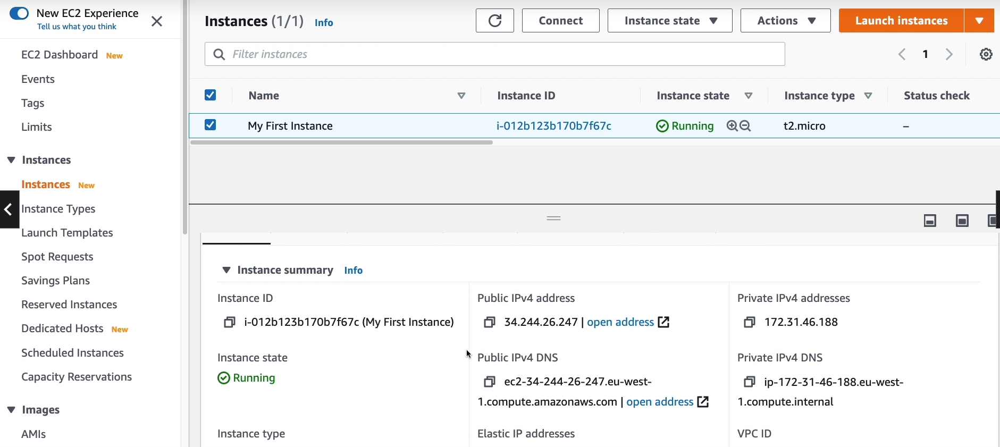

# **EC2 SECTION**

1. **EC2** is one of the most popular of AWS's offering.
2. **EC2** = Elastic Compute Cloud = Infrastructure as a Service.
3. It mainly consist in the capability of :

   - Renting Virtual Machines (EC2)
   - Storing data on virtual drives (EBS)
   - Distributing load across machines (ELB)
   - Scaling the services using an auto-scaling group (ASG)

4. Knowing EC2 is fundamental to understand how the Cloud works.

# **EC2 sizing & configuration options**

1. Operating System (OS) : Linux, Windows or Mac OS.
2. How much compute power & core (CPU).
3. How much random-access memory (RAM)
4. How much storage space :
   - Network-attached (EBS & EFS)
   - Hardware (EC2 Instance Store)
5. Network card: Speed of the card, Public IP address.
6. Firewall rules : Security group
7. Bootstrap script (configure at first launch) : EC2 User Data

# **EC2 User Data**

1. It is posible to bootstrap our instances using an **EC2 User Data** script.
2. **bootstrapping** meas launching commands when a machine starts.
3. That script is **only run** once at the instance **first start.**
4. EC2 user data is used to automate boot tasks suchs as:

   - Installing Updates.
   - Installing Software.
   - Downloading common files from the internet.
   - Anything you can think of.


5. The EC2 User Data Script runs with the root user.

NOTE: t2.micro is part of the AWS free tier (up to 750 hours per month)

# **HANDS - ON: LAUNCHING AN EC2 INSTANCE RUNNING LINUX**

NOTE:

1.  Instances => Launch Instances.

    Step 1 : Choose an Amazon Machine Image (AMI)

         - Quick Start
         - My AMIs
         - AWS MarketPlace
         - Community AMIs

    Step 1.1 : Choose Quick Start.

         - Amazon Linux (Free tier elegible). ==>  (Select)


    Step 2 : Choose an Instance Type.

         - Select : t2 t2.micro 1 1 EBS only - Low to Moderate Yes.


    Step 3 : Configure Instance Details.

         - Modified only = User data
         - This EC2 user data is a script that will be launched during the very and only first boot of  the isntance.
         - Paste the script :

            yum update -y
            yum install -y httpd
            systemctl start httpd
            systemctl enable httpd
            echo "<h1>Hello World from $(hostoma -f)</h1>">
            /var/www/html/index.html


    Step 4 : Add Storage = how much data's disk is going to be available on our EC2 instance.

         - Default parameters.


    Step 5 : Add Tags

         -Name My first Instance


    Step 6 : Configure Security Group

         - Create a new security group.
         - Add Rule :

                - HTTP TCP 80 0.0.0.0/0,::/0


    LAUNCH , Select an existing key pair or create a new key pair (Type RSA)

        - Download key pair file and save it.


    Go to instances :

        - My First | Instance | Instance ID | Instace State | Instance Type | Status check.

    Just copy and paste the public IPv4 address in google.
    What we get is a response named Hello World from this IP.

    NOTE: The power of the cloud while my instance is running, I'm going to pay for it.
    And if I stop it, I'm not going to pay for it.
    And I can terminate my instance at any time I want.
    I can also request one instance or 100 instances when I want.



# **EC2 INSTANCE TYPES - OVERVIEW**

1.  You can use different types of EC2 instances that are optimised for different use cases.
2.  AWS has the following naming convention:

                    - m5.2xlarge

3.  m : instance class
4.  5 : generation (AWS improves them over time)
5.  2xlarge : size within the instance class


NOTE: **General Purpose, Compute Optimized, Memory Optimized, Accelerated Computing, Storage Optimized, Instance Features, Measuring Instance, Performance.**

# **How to SSH into your EC2 Instance**

Well, we have our EC2 machine and we launched Amazon Linux two on it, and our machine has a public IP.
Now we want to access that machine, and so for this, we have a security group, and on it we allow the port 22 of SSH.
So what's going to happen is that our computer that will access the web through that port 22, it will access the EC2 machine,
and basically our command line interface is going to be just as if we were inside that machine.


IMPORTANT: EXAM QUESTION = When you first download a file, the permission is something called 0644, and that's too open,
and basically the private key can leak !
so basically because the private key is accessible by others, it will say bad permissions, and it will not allow you to SSH
into that machine. So to fix this is type : chmod 0400 EC2Tutorial.pem


# **How to use EC2 Instance Connect**

This is going to work only with Amazon X2 or Ubuntu.
The username is going to be EC2 User (ec2-user).


# **EC2 INSTANCE ROLES DEMO**

IMPORTANT: Never enter your IAM APA Key, So the access key ID and the secret access key into a EC2 Instance.
Instead what we have to do is use **IAM Rules**.

So, you need to back to the IAM Roles, and this have one policy name: **IAMReadOnlyAccess**. We need to attach this onto
our EC2 instance to provide it with credentials.

Go back to instances | Actions | Security | Modify IAM role | Choose the role | and save.


Then we run the command : aws iam list-users


# **EC2 Instance Types - General Purpose**

1.  Great for a diversity of workloads such as web servers or code repositories.
2.  Balance between

                    - Compute
                    - Memory
                    - Networking

3.  In the course, we will be using the t2.micro which is a General Purpose EC2 instance.

**EC2 INSTANCE TYPES - COMPUTE OPTIMIZED**

1.  Great for compute-intensive tasks that require high performance processors:

NOTE: Compute Optimized Instances are ideal for compute bound

                    - Batch processing workloads
                    - Media transcoding
                    - High performance web servers
                    - High performance computing (HPC)
                    - Scientific modeling & machine learning
                    - Dedicated gaming servers

**EC2 INSTANCE TYPES - STORAGE OPTIMIZED**

1. Great for storage-intensive tasks that require high, sequential read and write access to large data sets on local storage.

2. Use cases : High frequency online transaction processing (OLTP) systems
3. Realational & NoSQL databases
4. Cache for in-memory databases (for example, Redis)
5. Data warehousing applications
6. Distributed file systems

**INTRODUCTION TO SECURITY GROUPS**

1. Security Groups are the fundamental of network security in AWS.
2. They control how traffic is allowed into or out of our EC2 instances.
3. Security groups only contain **allow** rules
4. Security groups rules can reference by IP or by security group.

```
    Inbound Traffic
www ========>         SECURITY GROUP -------- EC2 INSTANCE
    Outbound Traffic
```

**SECURITY GROUPS DEEPER DIVE**

1.  Security groups are acting as a "firewall" on EC2 Instances.
2.  They regulate :

          - Access to Ports
          - Authorise IP ranges - IPv4 and IPv6
          - Control on inbound network (From other to the instance)
          - Control of outbound network (from the instance to other)


**SECURITY GROUPS GOOD TO KNOW**

1. Can be attached to multiple instances.
2. Locked down to a region /VPC combination.
3. Does live "outside" the EC2- if traffic is blocked the EC2 instance won't see it.
4. It's good to maintain one separate security group for SSH access.
5. If your application is not accessible (time out), then it's a security group issue.
6. If your application gives a "connection refused" error, then it's an application error or it's not launched.
7. All inbound traffic is blocked by default
8. All outbound traffic is authorised by defaul.

**Referencing other security groups Diagram**

NOTE: So we have an EC2 instance, and it has a security group, what I call group number one.
And the inbound rules is basically saying. I'm authorizing security group number on inbound and security
group number two.

If we launch another EC2 instance and it has security group two attached to it, well by using the security group (indistinct) rule that we just set up.

Basically allow our EC2 instance to go connect straight on the port we decided onto our frist EC1 instance.


**CLASIC PORTS TO KNOW**

1. 22 = SSH (Secure Shell) - log into a Linux instance.
2. 21 = FTP (File Transfer Protocol) - upload files into a file share.
3. 22 = SFTP (Secure File Transfer Protocol ) - upload files using SSH.
4. 80 = HTTP (Access unsecured websites)
5. 443 = HTTPS (Access secured websites)
6. 3389 = RDP (Remote Desktop Protocol) log into a windows instance.

# **SSH SUMMARY TABLE / How do you connect inside of your servers to perform some maintenance or action**

The SSH = Is a command line interface utility.

1. For **linux and MAC** server we can use **SSH** = to do a secure shell into our servers.

2. For windows < 10 = **Putty**

3. windows >= 10 = **SSH** and **Putty**

4. Mac, linux, windows < 10 and Windows >= 10 : **SSH, Putty, EC2 Instance Connect.**

# **HOW TO SSH INTO YOUR EC2 INSTANCE**

Linux / Mac OS x

1. We'll learn how to SSH into your EC2 instance using Linux / Mac.
2. SSH is one of the most important function. It allows you to control a remote machine, all using the command line.

**STEPS**

1.  INSTANCES

          - At the bottom we have Public DNS and IPv4
          - The IPv4 is basically how I can coonect from my computer over the web to this instance and this is why we have a public IP, so 35-180-100-144.

          - Open your terminal and =
          -NOTE: Ec2-user is basically the Linux user into our Amazon Linux machine, and @ basically defines the IP.

               - ssh ec2-user@35.180.100.144
               - yes, but error because the key is missing.
               - Check for the EC2Tutorial.pem FILE.
               - ssh -i EC2Tutorial.pem ec2-user@35.180.100.144

    //IMPORTANT:**- WARNING : UNPROTECTED PRIVATE KEY FILE!** TEST QUESTION.

               - Permission 0644 for 'EC2Tutorial.pem' are too open.
               - It is required that your private key files are NOT accessible by others.
               - This private key will be ignored
               - Load key "EC2Tutorial.pem": bad permissions
               - Permission denied

               -**To fix this** =  chmod 0400 EC2Tutorial.pem

               -Know if you run again =
                    - ssh -i EC2Tutorial.pem ex2-user@35.180.100.144

               - AMAZON Linux 2 AMI ======> we are in the machine!!

               - If we right = whoami ===> ec2-user

# **EC2 INSTANCE CONNECT (It's another way to connect your instance)**

STEPS : Instances

STEP1 = Connect
STEP2 = EC2 INSTANCE CONNECT
STEP3 = Username (ec2-user)
STEP4 = Connect

               - Amazon Linux 2 AMI

# **EC2 INSTANCE ROLES DEMO**

**For security we need to attach the IAM Role to our EC2 Instance to provide it with credentials**

**EC2 > Instances > i-04771d0301c1aca18f**

**STEPS:**

               - Instances - action - security - Modify IAM role
               - Choose IAM Role ==> DemoRoleForEC2 ==> Save
               - Now the DemoRoles is attach.

               - Now when we write inside the console =
                    - aws iam list-users

                    the response is :

                    {
                         "users": [
                              {
                                   "userName":"stephane"
                                   "PasswordLastUsed":"2021-04-19T20:41:59Z",
                                   "CreateDate":"2021-04-19T20:38:18Z",
                                   "UserId": "AIDATCOXNUAWA5KFV6MM7",
                                   "Path": "/",
                                   "Arn":"arn:aws:iam::211442049068:user/stephane"
                              }
                         ]
                    }

# **EC2 INSTANCES PURCHASING OPTIONS**

1.  On-Demand Instances: short workload, predictable pricing.
2.  Reserverd: (Minimun 1 Year).

          -Reserved Instances : long workloads.
          - Convertible Reserved Instances : long workloads with flexivle instances
          - Scheduled Reserved Instances : Example - every Thursday between 3 and 6 pm.

3.  Spot Instances : short workloads, cheap, can lose instances (less reliable).
4.  Dedicated Hosts : Book an entire physical server, control isntance placement.

**EC2 ON DEMAND**

1.  Pay for what you use :

          - Linux or Windows - billing per second, after the first minute.
          - All other operating systems - billing per hour.

2.  Has the highest cost but no upfront payment.
3.  No long-term commitment.
4.  Recommended for short-term and un-interrupted workloads, where you can't predict how the application will behave.

**EC2 RESERVED INSTANCES**

1.  Up to 75% discount compared to On-demand.
2.  Reservation period: 1 year = + discount | 3 years = +++ discount.
3.  Purchasing options : no Upfront | partial Upfront =+ | All upfront = ++ discount.
4.  Reserve a specific instance type.
5.  Recommended for steady-state usage applications (Think database).

6.  **Convertible Reserved Instance**

          - Can change the EC2 instance type.
          - Up to 54% discount.

7.  **Scheduled Reserved Instances**

          - Launch within time window you reserve
          - When you require a fraction of day / week / month
          - Still commitment over | to 3 years.

**EC2 SPOT INSTANCES**

          - Useful for workloads that are resilient to failure.
               - Batch Jobs
               - Data Analysis
               - Image processing
               - Any Distributed workloads
               - Workloads with a flexible start and end time.

          - Not suitable for critical jobs or databases.

**EC2 DEDICATED HOSTS**
IMPORTANT: QUESTION EXAM :

          -An amazon EC2 DEDICATED HOST IS A PHYSICAL SERVER WITH EC2 INSTANCE
          - capacity fully dedicated to your use. Dedicated Hosts can help you address
          -COMPLIANCE REQUIREMENTS and reduce cost by allowing you to USE YOUR EXISTING SERVER -BOUND SOFTWARE LICENSES.

          1. Allocated for your account for 3 year period reservation.
          2. More expensive.
          3. Useful for software that have complicated licensing model (BYOL-Bring Your Own License).
          4. Or for companies that have strong regulatory or compliance needs.

**EC2 DEDICATED INSTANCES**

          - Instances running on hardware that's dedicated to you.
          - May share hardware with other instances in same account.
          - No control over instance placement (can move hardware after stop/ start).


# **SHARED RESPONSIBILITY MODEL FOR EC2**

          - AWS =
               - Infrastructure (global network security).
               - Isolation on physical hosts.
               - Replacing faulty hardware.
               - Compliance validation.
          - USER =
               - Security Groups rules.
               - Operating - system patches and updates.
               - Software and utilities installed on the EC2 instance.
               - IAM Roles asigned to EC2 & IAM user access management.
               - Data security on your instance.
