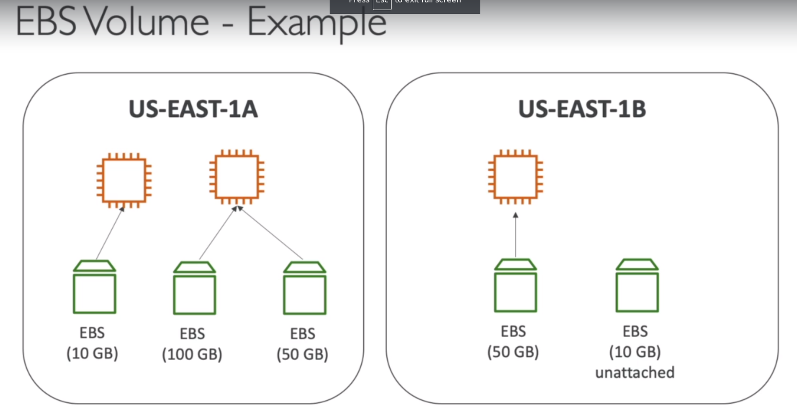
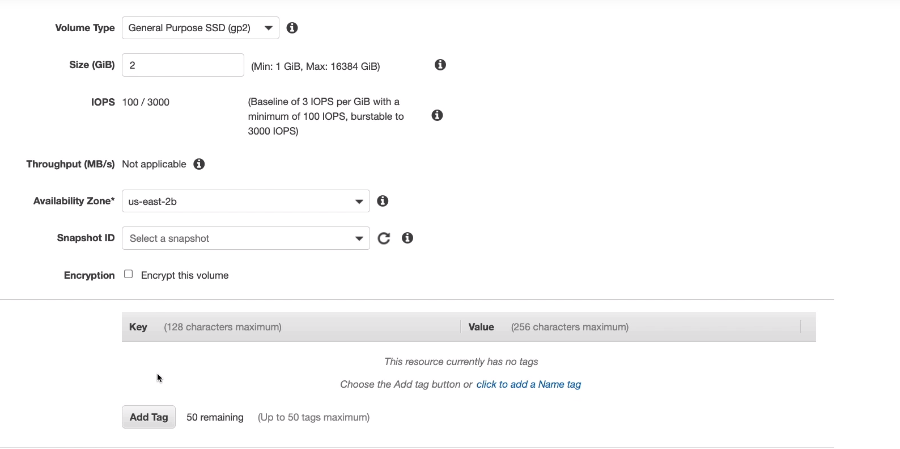
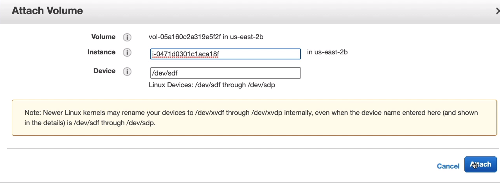
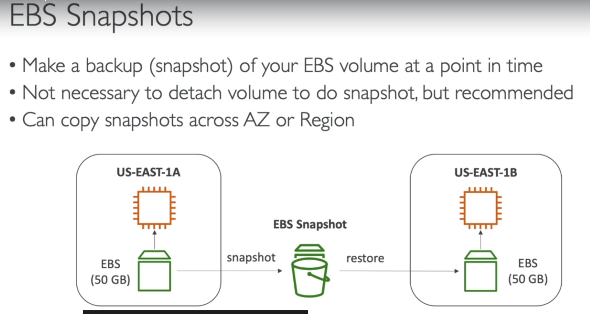
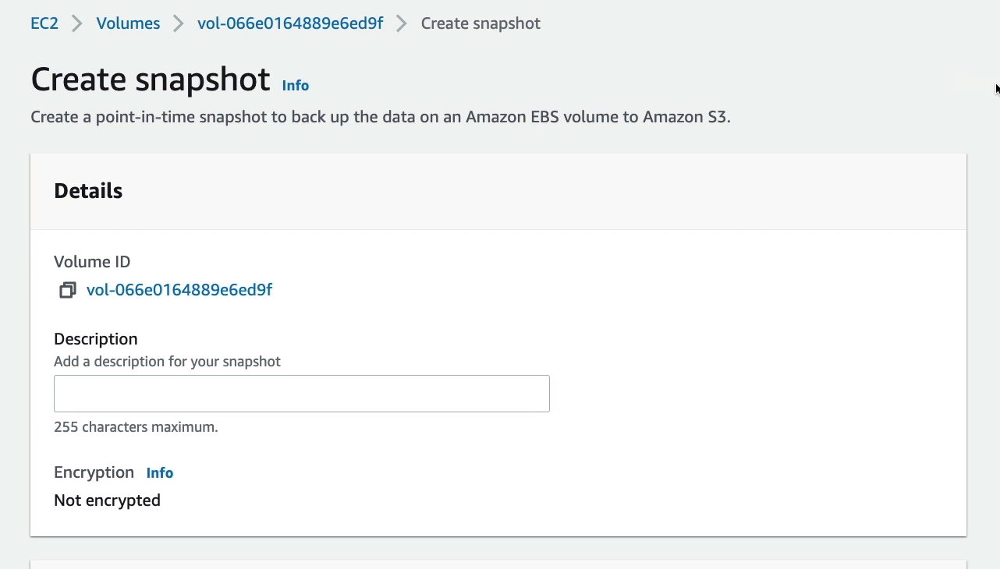
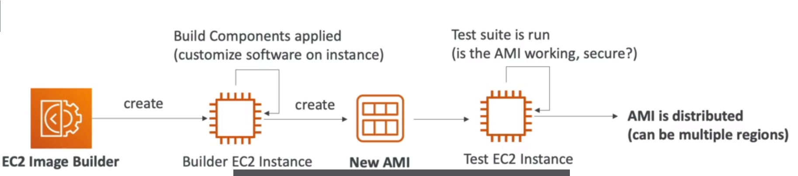
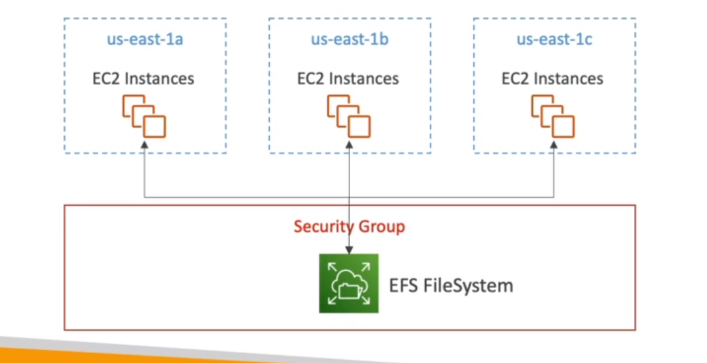
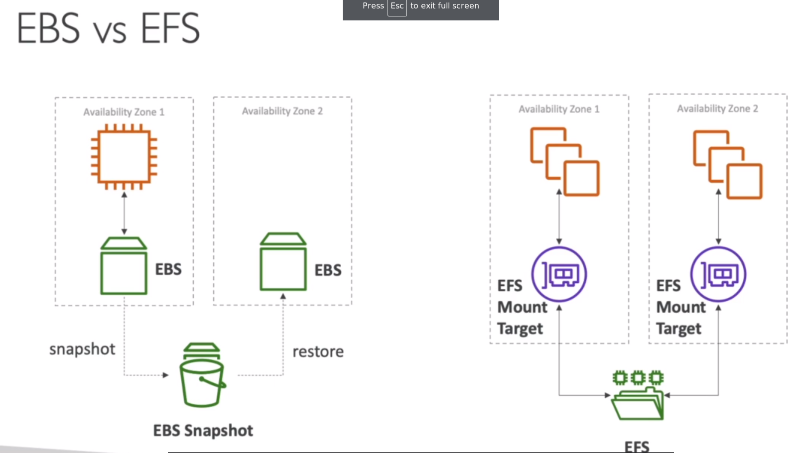
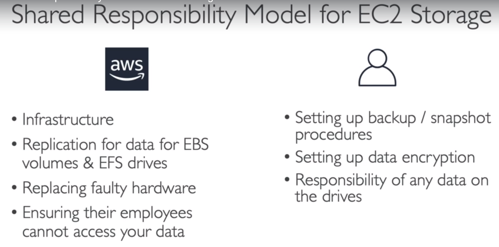

# **EBS OVERVIEW**

**What's an EBS Volume?**

1. An EBS (ELASTIC BLOCK STORE) Volume is a network drive you can attach to your instances while they run.
2. It allows your instances to persist data, even after their termination.
3. They can only be mounted to one instance at a time (at the CCP Level).
4. THey are bound to a specific availability zone.
5. Analogy: Think of them as a "network USB stick"
6. Free tier : 30 GB of free EBS storage of type General Purpose (SSD) or Magnetic per month.

NOTE: CCP- Certified CLoud Practitioner one EVS can be only mounted to one EC2 instance associate level (Soluctions architect developer, sysOps) : "multi attach" feature for some EBS.

7. It's a network drive (i.e not a physical drive)

   - It uses the network to communicate the instance, which means there might be a bit of latency.
   - It can be detached from a EC2 instance and attached to another one quickly.

8. It's locked to an Availability Zone (AZ).

   - An EBS Volume in US-EAST-l a cannot be attached to us-east-lb
   - To move a volume across, you first need to snapshot it.

9. Have a provisioned capacity (size in GBs, and IOPS).
   -You get billed for all the provisioned capacity.
   -You can increase the capacity of the dribe over time.

# **EBS - DELETE ON TERMINATION ATTRIBUTE**

IMPORTANT: When we create EBS Volumes through EC2 intances, there is this thing called a Deletes on Termination attribute.

When we create an EBS in the console, WHen we create a EC2 instance there the second last column called **delete on termination**
and by default, it is ticked for the Root Volume and not ticked for a new EBS Volume.
So this controls the EBS behavior, when an EC2 instance is being terminated.
So by default, as we can see, the root EBS Volume is deleted alognside the instance being terminated.
And the default any other attached EBS Volume is not deleted.
Because it's disabled by default.
This can be controlled by the AWS console / AWS CLI
If you want to preserve the root volume, when an isntance is terminated, for example, to save some data then you can disable delete on termination.

# **EBS HANDS ON**

1. Create Volume = and we can create a volume type of type gp2.
2. size (GiB)
3. Availability Zone = Create in one availability zone that is the same of the one where my EC2 instance has been created.

4. At the end we have 2 volumes, So one is in use, and this is the root volume of my machine. And the other one is a two gigabyte
   volume that is currently available.
5. right click and attach the volume = into our EC2 instance.(because it is in the same availability zone) as our EBS Volume.

# **EBS SNANPSHOTS**

1. Make a backup (snapshot) of your EBS Volume at a point in time.
   (The idea is that you will be able to back up the state of it) and even if the EBS volume is terminated later on.
2. Not necessary to detach volume to do snapshot, but recommended.
3. Can copy snapshts across AZ or Region.

NOTE: The idea is transfer some of your data in a different region on AWS, to leverage the global infrastructure.
If we look at US-EAST-1A and we want to transfer an EBS volume to US-EAST-1B the way we do it is that we would habe the EBS
volume attached to the EC2 instance, and then we would snapshot it. So maybe we would stop the EC2 instance ahead of time.
to make sure the snapshot is clean, now the EBS shapshots exist in your region and that EBS snapshot can be used to restore a new EBS volume in another availability zone.
When is done, we can attach the new EBS Volume, to an EC2 instance in US-EAST-1B

# **EBS SNAPSHOTS FEATURES**

1. **EBS SNAPSHOT ARCHIVE**
   a. Move a snapshot to an "archive tier" that is 75% cheaper.
   b. Takes within 24 to 72 hours for restoring the archive.

2. **RECYCLE BIN FOR EBS SNAPSHOTS**
   a. Setup rules to retain deleted snapshots so you can recover them after an accidental deletion.
   b. Specify retention (from 1 day to 1 year).

**EBS SNAPSHOTS HANDS ON**
//NOTE:

1. We have this two gigabytes gp2 EBS Volume available to us and we can take a snapshot from it. So if we do actions, we can create a snapshot.

2. Click in snapshot and then you can copy that snapshot in another region, and this can come in very handy in case you want.
   for example, to have a disaster recovery strategy.
   To make sure data is back up in another region of AWS.
3. Another thing is you can recreate a volume from it, in (Create Volume from snapshot).
4. Archive Snapshot.

# **AMI OVERVIEW**

1. AMAZON MACHINE IMAGE
2. AMI are a customization of an EC2 instance.
   a. You add your own software, configuration, operating system, monitoring...
   b. Faster boot / configuration time because all your software is pre-packaged.

3. AMI are built for a specific region (and can be copied across regions).
4. You can launch EC2 instances from :
   a. a public AMI: AWS provided.
   b. Your own AMI: you make and maintain them yourself.
   c. An AWS Marketplace AMI: an AMI someone else made (and potentially sells).

**AMI PROCESS (From an EC2 instance)**

1. Start an EC2 instance and customize it.
2. Stop the instance (for data integrity).
3. Build an AMI = this will also create EBS snapshots.
4. Launch instances from other AMIs.

IMPORTANT:

# **EC2 IMAGE BUILDER**

1. Used to automate the creation of Virtual Machines or container images.
2. Automate the creation, maintain, validate and test EC2 AMIs.
3. Can be run on a schedule (weekly, whenever packages are updated, etc...).
4. Free service (only pay for the underlying resources).

# **EC2 INSTANCE STORE**

1. EBS Volumes are network drives with good but "limited" performance.
2. If you need a high-performance hardware disk, use EC2 instance Store.
3. Better I/O Performance.
4. EC2 Instance Store lose their storage if they're stopped (ephemeral).
5. Good for buffer | Cache | Scratch data | temporary content.
6. Risk of data loss if hardware fails.
7. Backups and Replication are your responsability.

# **EFS ELASTIC FILE SYSTEM** (THird type of storage you can attach onto EC2 Instance.)

1. Managed NFS (network file system) that can be mounted on 100s of EC2.
2. EFS works with Linux EC2 instances in multu-AZ.
3. Highly available, scalable, expensive, (3x gp2), pay per use, no capacity planning.

# **DIFFRENCES BETWEEN EBS VS EFS**

NOTE: Then the EBS volume can only be attached to one instance in one specific AZ and the EBS volumes are bound to specific availability zones. But if we wanted to move over the EBS volume. from one AZ to another, we could create a snapshot it would
create an EBS snapshot and then restore that snapshot into a new availability zone.
and effectively we would've moved the EBS volume over.

NOTE: Now the EFS drive is shared by everything that is mounted to it, we have many instances in Availability zone 1 on one, or
many instances as well on Anailability Zone 2. At the same time all this instances can mount the same EFS drive. Using a mount target, and they will all see the same files.

So, that makes it a shared file system.

# **EFS INFREQUENT ACCESS (EFS-IA)**

1. Storage class that is cost-optimized for files not accessed every day.
2. Up to 92% lower cost compared to EFS Standard.
3. EFS will automatically move your files to EFS-IA based on the last time they were accessed.
4. Enable EFS-IA with a lifecycle Policy.
5. Example: move files that are not accessed for 60 days to EFS-IA.
6. Transparent to the applications accessing EFS.

# **SHARED RESPONSIBILITY MODEL FOR EC2 STORAGE**

# **AMAZON FSX OVERVIEW**

1. Launch 3rd party high-performance file systems on AWS.
2. Fully managed service, highly reliable, and scalable Windows native shared file system.
3. Built on Windows File server.
4. Supports SMB protocol & Windows NTFS.
5. Integrated with Microsoft Active Directory.
6. Can be accessed from AWS or your on-premise infrastructure.

**AMAZON FSx for Lustre**

1. A fully managed, high-performance, scalable file storage for **High Performance Computing(HPC)**
2. The name Lustre is derived from "Linux" and "cluster".
3. Machine Learning, Analytics, Video Processing, Financial Modeling...
4. Scales up to 100s GB/s, millions of IOPS, sub-ms latencies.
