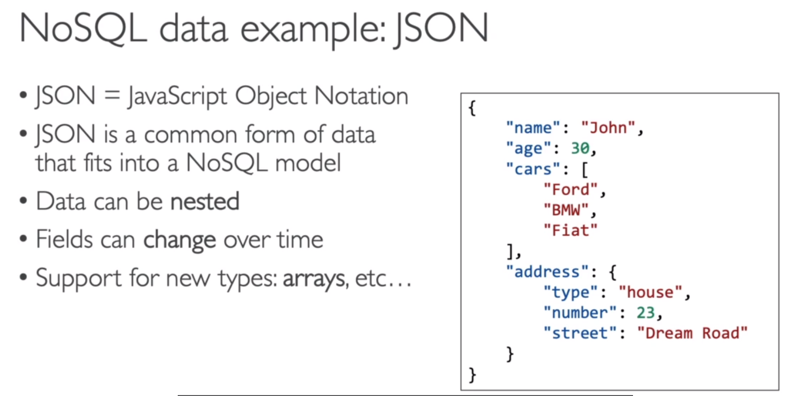
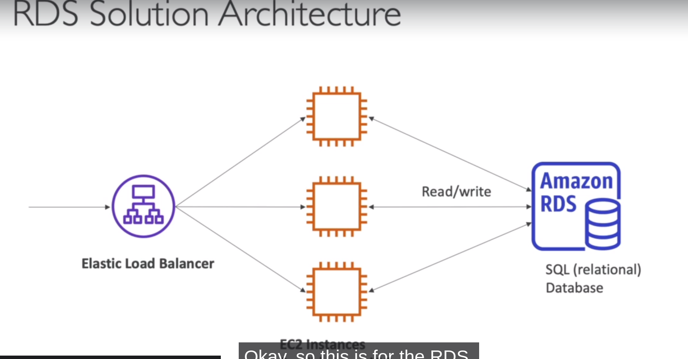
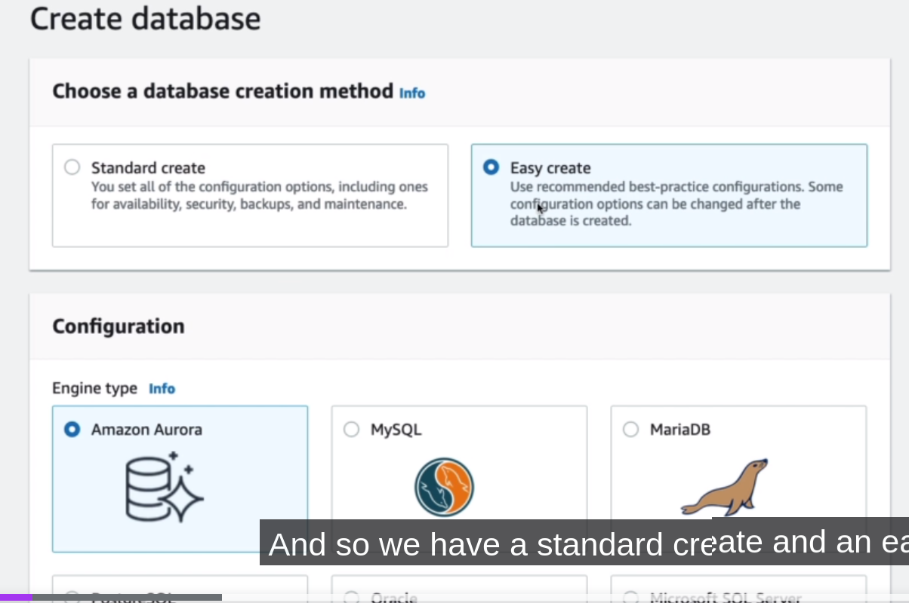
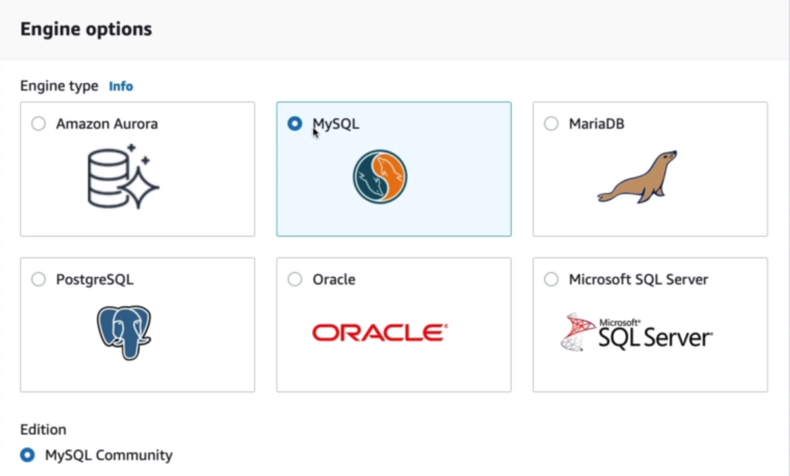
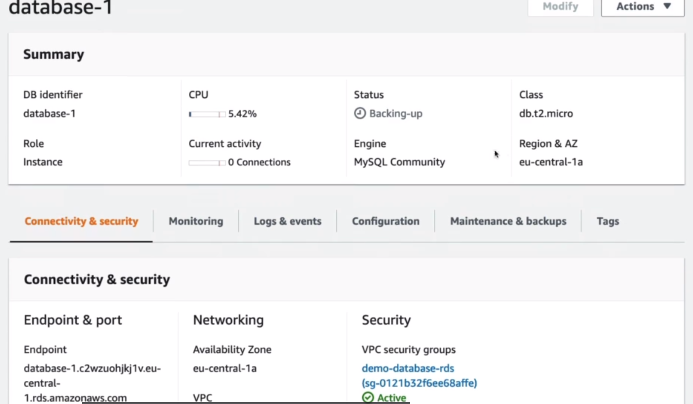
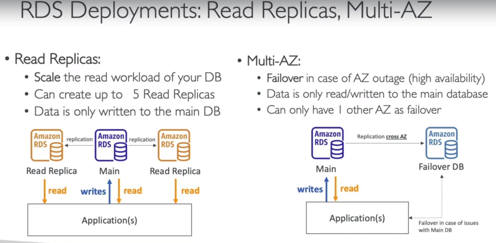
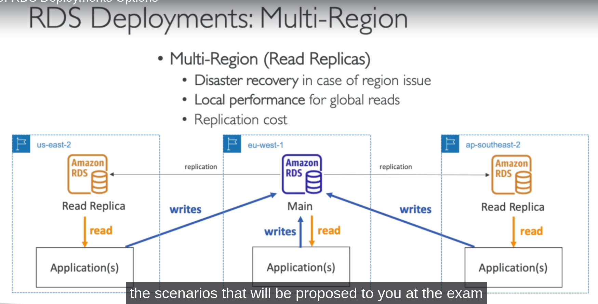
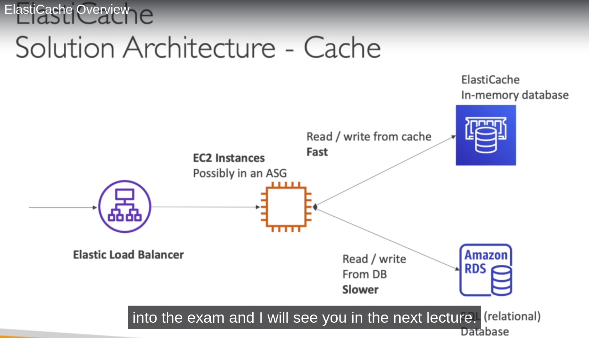

# **DATABASES INTRO**

NOTE: When you are storing data on disk, would it be on an EBS drive, an EBS volume, and EC2 Instance Store, Amazon S3, you have your limits.

If you want to store data in the structure way, you may want to store it in a database. And the structure is going to allow you
to build indexes and to efficiently query or search through the data.

Well we have with EFS EBS, EC2 Instance Store and Amazon S3, we can do per files operations, with databases, it's going to be a lot more structured.

We can define relationships between your datasets.

So this databases nowadays they're all optimized for a purpose, and they will come with different features, shapes and constraints.

From an exam perspective, it's up to you to understand, which database is going to fit best at the use case given to you by the question.

## **RELATIONAL DATABASES**

## **NOSQL DATABASES**

1.  NoSQL = non-SQL = non relational databases.
2.  NoSQL databases are purpose built for specific data models and have flexible schemas for building modern applications.

3.  Benefits:

        a. Flexibility: easy to evolve data model.
        b. Scalability: Designed to scale-out by using distributed clusters.
        c. High-performance: optimized for a specific data model.
        d. Highly functional : types optimized for the data model.

4.  Examples: Key-value, document, graph, in-memory, search databases.

## **DATABASES & SHARED RESPONSIBILITY ON AWS**

1.  AWS offers use to manage different databases.
2.  Benefits include:

        a. Quick Provisioning, High Availability, Vertical and Horizontal Scaling.
        b. Automated Backup & Restore, Operations, Upgrades.
        c. Operating System Patching is handled by AWS.
        d. Monitoring, alerting.

NOTE: Many databases technologies could be run on EC2, but you must handle yourself the resiliency, backup, patching, high, availability, fault, tolerance, scaling...

# **DATABASES - AWS RDS OVERVIEW**

1.  RDS stands for Relational Database Service.
2.  It's a managed DB service for DB use SQL as a query language.
3.  It allows you to create databases in the cloud that are managed by AWS.

        a. Postgres.
        b. MySQL.
        c. MariaDB.
        e. Oracle.
        f. Microsoft SQL Server.
        g. Aurora (AWS Proprietary database).

NOTE: **WHY WOULD WE USE RDS INSTEAD OF DEPLOYING OUR OWN DATABASE ON EC2????**

**ADVANTAGE OVER USING RDS VERSUS DEPLOYING DB ON EC2**

1.  RDS Is a managed service:

        a. Automated provisioning, OS patching. (WILL BE DONE BY AWS)!
        b. Continuos backups and restore to specific timestamp (Point in Time Restore)!!
        c. Monitoring dashboards.
        d. Read replicas for improved read performance.
        e. Multi AZ setup for DR (DISASTER RECOVERY).
        f. Maintenance windows for upgrades.
        g. Scaling capability (vertical and horizontal).
        h. Storage backed by EBS (gp2 or io1) type volume.

IMPORTANT: BUT you can't SSH into your instances, we cannot use the SSH utility to see what's going on within our database.

**RDS SOLUTION ARCHITECTURE**

It's fronting multiple backend EC2 instances, they are possibly into an auto scaling group, and they need to store and share the data somewhere, and this is structured data so they're not going.

To use EBS or EFS or EC2 instance store, they will be using a database. IN THIS EXAMPE IS GOING TO BE SQL DATABASE .
and the EC2 instances will be connecting to database, and doing read/writes and all at once.

So they will be sharing the database in the backend.

**AMAZON AURORA**

1. Aurora is a proprietary technology from AWS (not open sourced).
2. PostgreSQL and MySQL are both supported as Aurora DB.
3. Aurora is "AWS cloud optimized" and claims 5x performance improvement over MySQL on RDS, over 3x the performance of Postgres on RDS.
4. Aurora storage automatically grows in increments of 10GB, up to 64 TB.
5. Aurora costs more than RDS **(20% more)** but is more efficient.
6. Not in the free tier.

**DATABASE HANDS ON**

1. Create database.
2. Choose database creation method = Easy Create.

3. Engine Options = MySQL.

4.  Edition

        a. MySQL Community.

5.  Templates

        a. Free Tier.

**RDS DEPLOYMENTS : Read Replicas, Multi AZ**

**READ REPLICAS :** That reads from your main RDS database, but say that now you need to scale the read workloads, we have more and more applications. that need to read more and more data from RDS.

The way you can do it is by creating Read Replica, so that means that there is gonna be some copies, SOME REPLICAS OF YOUR RDS DATABASE.

That are going to be created and this is going to allow your applications to read from this read replica also. and therefore
you are distributing the reads, to many different RDS databases.

So you can create up to 5 read replicas, When it comes to writing data, writing data is only done to the main database, so your application still have to write to the only one central RDS database.

**MULTI-AZ**: This is helpful when you have to have failover in case of an AZ outage. So in case in the availability zone, LIKE CRASHES, and this give you high availability.

In this example your applications to read and write from the same main RDS database.
But we are going to set up, a replication crozz AZ, so in another different availability zone.
And this is going to be failover database, and this is why it's called Multi-AZ because it's a different AZ.

Now in case the main RDS database crashes, for whatever reason maybe there's an issue with it, or maybe because the AZ is having problems, then RDS will trigger a failover.

AND THEN your application will failover to developer database in a different AZ.
So in this case, data is only read and written to the main database. The failover DB is passive, it's not accessible until there is an issue, with the main database.

and you can only have one other AZ Zone as a failover AZ.

**RDS DEPLOYMENTS: MULTI-REGION**

                a. Multi-Region (Read Replicas).
    This time, instead of being in the same region, they are across defferent regions.
    In this example we have EU-West one for RDS database, and we are going to create a read replica in US-East two.
    and applications in US-East two can read locally from this read replica.

    But anytime this application needs to write data, the writes need to happen across region, and we need to write the data to USE One.

    Same if you weere to have also another region in AP-Southeast two so in Australia, You'd have the same concepts.
    So why would you want a multi region type of deployments??

            1. Because you want to set up a disaster recovery strategy, in case of a region issue. So if EU-West one is having a regional issue. Then you have a backup in either ES-East two. or AP-East-two and this is why it's a disaster recovery strategy.

            2. Our applications that are in different regions get better performance, because they're read from a local database, so they have less latency.

            3. You need to understant that bacause you are replicating data across regions, then there is going to be a replication cost associated with a network transfers of data between regions.

# **AMAZON ELASTICACHE**

1. The same way RDS is to get managed Relational Databases.
2. ElastiCache is to get managed Redis or Memcached.
3. Caches are in-memory databases with high performance, low latency.
4. Helps reduce load off databases for read intensive workloads.
5. AWS TAKES CARE OF OS maintenance / patching, optimizations, setup, configuration, monitoring, failure recovery and backups.

# **DYNAMO DB OVERVIEW**

1. Fully managed Highly available with replication across 3 AZ.
2. NoSQL database, not a relational database.
3. Scales to massive workloads, distributed "serverless" database.
4. Millions of requests per seconds, trillions of row, 100s ofTB of storage.
5. Fast and consistent in performance.
6. **Single-digit milisecond latency - low latency retrieval.** ====> EXAM KEYWORDS
7. Integrated with IAM for security, authorization and administration.
8. Low cost and auto scaling capabilities.
9. Standard and Infrequent Access (IA) Table Class.

**DYNAMO DB TYPE OF DATA**

1. Dynamo DB is a key/value database.

NOTE: You have a primary key, which is made of one or two columns, a partition key and a sort key. And then attributes on the right hand side. Where you can define your own columns for your data.

Finally, all the items are going to be row by row, and this is how a DynamoDB table works.
But again, remember its a NoSQL database.

It has low latency retrieval of data and you also get access to a serverless database.

**DYNAMO DB ACCELERATOR - DAX**

Then we have DynamoDB Accelerator also called DAX.

1. Fully Managed in-memory cache for Dynamo DB.
2. 10X performance imporvement -single- digit milliseconds latency to microseconds latency- when accessing your Dynamo DB tables.
3. Secure, highly scalable & highly available.
4. Difference with ElastiCache at the CCP level : DAX is only used for and is integrated with Dynamo DB, while ElastiCache can be used for other databases.

# **REDSHIFT**

1. Redshift is based on PostgreSQL, but it's not used for OLTP.
2. It's OLAP online analytical procesing(analytics and data **warehousing**).
3. Load data once every hour, not every second.
4. 10x better performance than other data warehouses, scale to PBs of data.
5. Columnar storage of data (instead of row based).

# **EMR**

1. EMR stands for ELASTIC MAPREDUCE.
2. EMR helps creating **Hadoop clusters** (Big Data) to analyze and process vas amount of data.
3. The clusters can be made of hundreds of EC2 instances.
4. Also supports Apache, Spark, HBase, Presto, Flink.
5. USE CASES : DATA PROCESSING, MACHINE LEARNING, WEB INDEXING, BIG DATA.

# **ATHENA**

1. Serverless query service to perform analytics against S2 objects.
2. Uses Standards SQL language to query the files.
3. Supports CSV JSON ORC Avro and Parquet.

# **QUICKSIGHT**

1. Serverless machine learning-powered business intelligence service to create interactive dashboards.
2. Fast, automatically scalable, emdeddable, with per-session pricing.

USES CASES: Business analytics, Building visualizations, Perform ad-hoc analysis, Get business insights using data.

# **DOCUMENT DB**

1. DocumentDB is the same for MongoDB (which is a NoSQL database).

2. MongoDb is used to store, query and index JSON data.
3. Similar "deployments concepts" as Aurora.

# **NEPTUNE**

1. Fully managed **graph** database.
2. A popular graph dataset would be a social network.

# **QLDB**

1. QUANTUM LEDGER DATABASE.
2. A ledger is a book recording financial transactions.
3. Fully managed, serverless, high available, replications across 3 AZ.
4. USED TO REVIEW HISTORY OF ALL THE CHANGES MADE TO YOUR APPLICATION DATA OVERTIME.
5. IMMUTABLE SYSTEM.

# **GLUE**

1. Managed extract, transform, and load (ETL) service.
2. Useful to prepare and transform data for analytics.
3. Fully **serverless** service.
