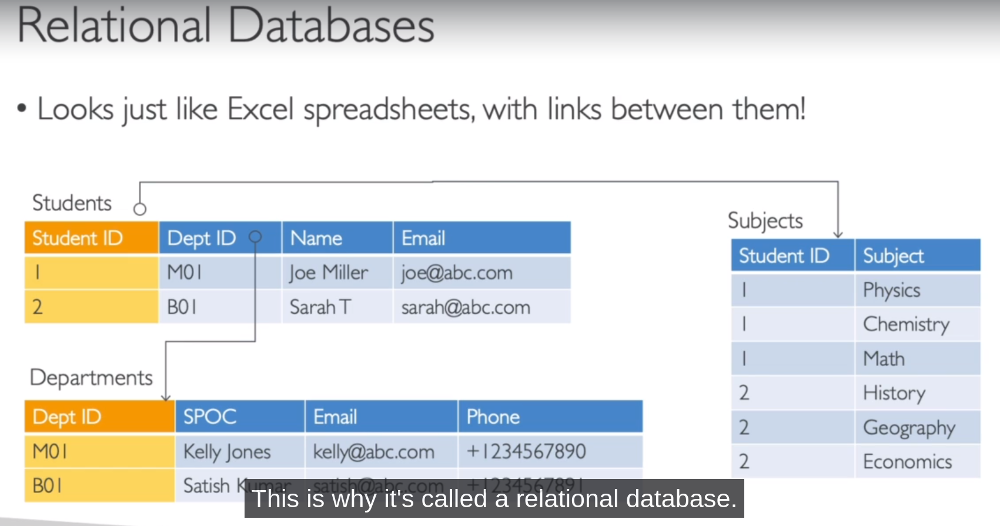

# **DATABASES INTRO**

NOTE: When you are storing data on disk, would it be on an EBS drive, an EBS volume, and EC2 Instance Store, Amazon S3, you have your limits.

If you want to store data in the structure way, you may want to store it in a database. And the structure is going to allow you
to build indexes and to efficiently query or search through the data.

Well we have with EFS EBS, EC2 Instance Store and Amazon S3, we can do per files operations, with databases, it's going to be a lot more structured.

We can define relationships between your datasets.

So this databases nowadays they're all optimized for a purpose, and they will come with different features, shapes and constraints.

From an exam perspective, it's up to you to understand, which database is going to fit best at the use case given to you by the question.

## **RELATIONAL DATABASES**

## **NOSQL DATABASES**

1.  NoSQL = non-SQL = non relational databases.
2.  NoSQL databases are purpose built for specific data models and have flexible schemas for building modern applications.

3.  Benefits:

        a. Flexibility: easy to evolve data model.
        b. Scalability: Designed to scale-out by using distributed clusters.
        c. High-performance: optimized for a specific data model.
        d. Highly functional : types optimized for the data model.

4.  Examples: Key-value, document, graph, in-memory, search databases.
