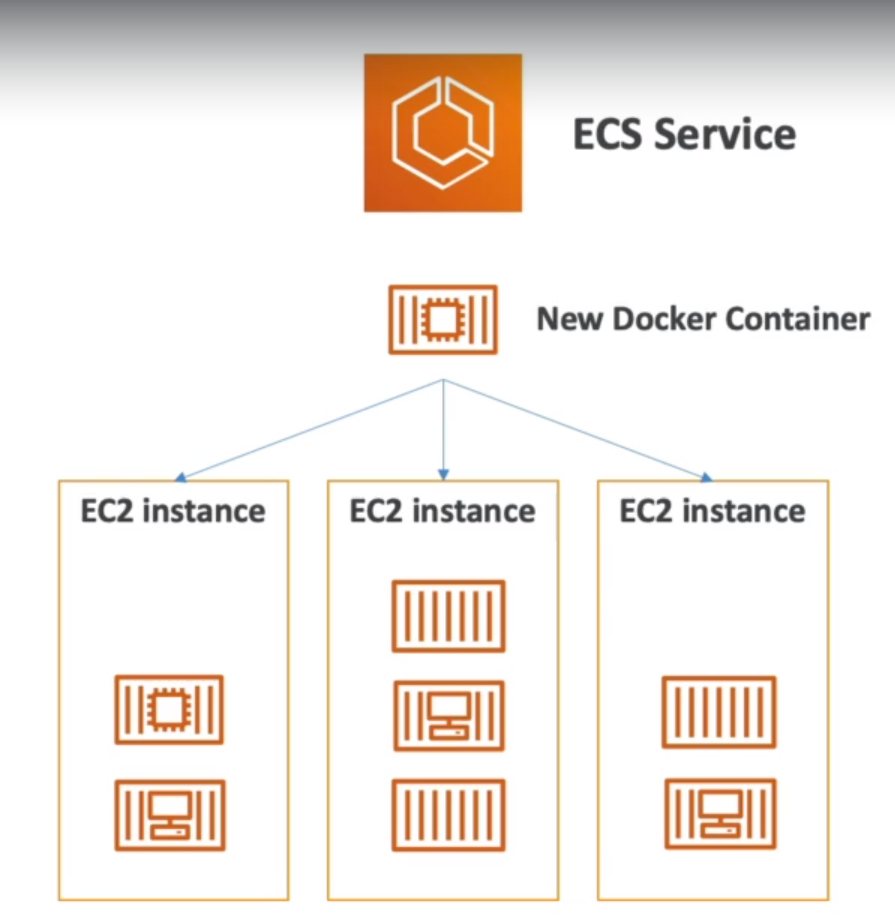
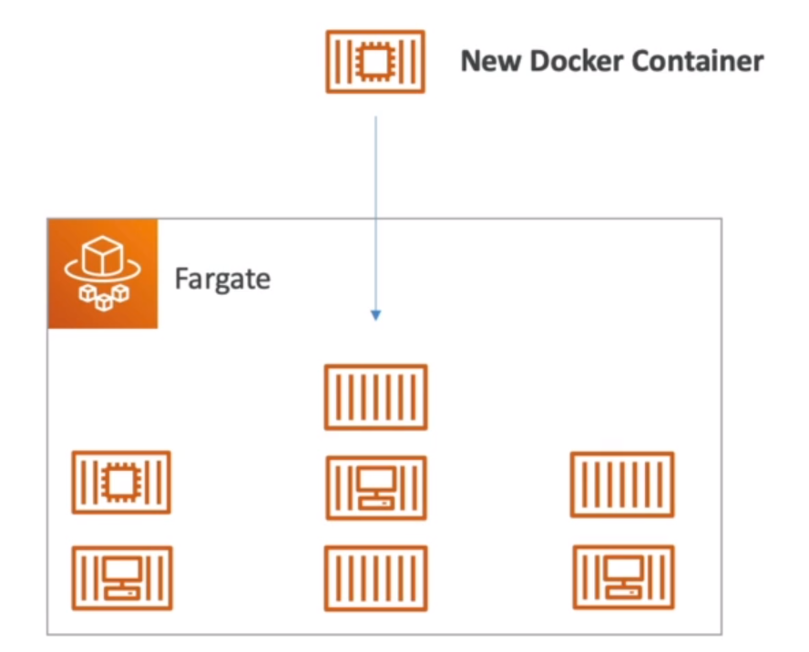
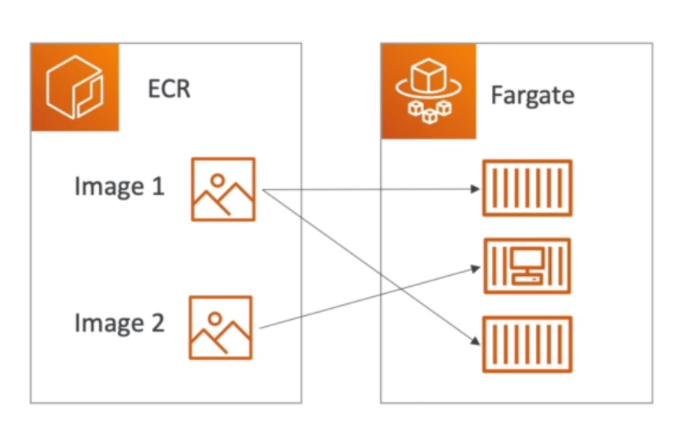

# **DOCKER VS VIRTUAL MACHINES**

1. Docker is "sort of" a virtualization technology, but not exactly.
2. Resources are shared with the host => many containers on one server.

# **ECS**

1. **ECS** = ELASTIC CONTAINER SERVICE.
2. **Launch Docker** containers on AWS.
3. You must provision & maintain the infrastructure(the EC2 instances).
4. AWS takes care of starting / stopping containers.
5. Has integrations with the Application Load Balancer.

# **FARGATE**

1. Launch Docker Containers on AWS.
2. You do not provision the infrastructure (no EC2 instances to manage) - simpler!!
3. Serverless offering.
4. AWS just runs containers for your based on the CPU / RAM YOU NEED!

# **ECR**

1. **Elastic Container Registry**
2. Private Docker Registry on AWS.
3. This is where you store your Docker images so they can be run by ECS or Fargate.

# **SERVERLESS CONCEPT**

1.  Serverless is a new paradigm in which the developers don't have to manage servers anymore.
2.  They just deploy code.
3.  They just deploy functions!!.
4.  Initially serverless was equal to FaaS (Function as a Service).
5.  Serverless was pioneered by AWS Lambda but now also includes anything that's managed. "databases, messaging, storage, etc."
6.  Serverless does not mean there are no servers...
    it means you just don't **manage / provision / see them.**

    NOTE: AMAZON S3

             Amazon S3 can scale infinitely, there was no servers, it was just uploaded file, and that was it.

    NOTE: DYNAMODB

             We created a table, but we didn't provision a server for that table.
             and that server was, that table could auto scale, based on the load it was receiving.

    NOTE: FARGATE:

            Was to run Docker containers, and as I said with ECS, you create EC2 instances to run the Docker containers so that would not be serverless,
            but with Fargate you just send the Docker containers And Fargate will automatically find a way for it to be run.

    NOTE: LAMBDA:

            Allows you to run functions in the cloud.
