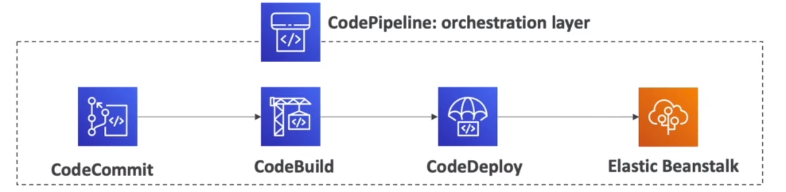

# **Cloud Formation**

1. Cloud Formation is a declarative way of outlining your AWS Infrastructure, for any resources (most of them are supported).
2. For example, within a CloudFormation template, you say :

   ```
       I want a security group.
       I want two EC2 instances using this security group.
       I want an S3 bucket.
       I want a load balancer (ELB) in front of these machines.
   ```

3. Then CloudFormation creates those for you, in the right order, with the exact configuration that you specify.

# **Benefits of AWS CloudFormation(1/2)**

//NOTE: with CloudFormation it's super easy to create and delete resources, which is one of the biggest cloud principle.

1. Infrastructure as code.

   ```
       1. No resources are manually created, which is excellent for control.
       2. Changes to the infrastructure are reviewed through code.
   ```

2. Cost :

   ```
       1. Each resources within the stack is tagged with an identifier so you easily see how much a stack costs you.
       2. You can estimate the costs of your resources using the CloudFormation template.
       3. Savings strategy: In Dev, you could automation deletion of templates at 5 PM and recreated at 8 AM, safely.
   ```

# **Benefits of AWS CloudFormation (2/2)**

1. Productivity

   ```
      1. Ability to destroy and re-create an infrastructure on the cloud on the fly.
      2. Automated generation of Diagram for your templates !
      3. Declarative programming (no need to figure out ordering and orchestration)
   ```

2. Don't re-invent the wheel

   ```
       1. Leverage existing templates on the web!
       2. Leverage the documentation.
   ```

3. Supports(almost) all AWS resources:

   ```
       1. You can use "Custom resources" for resources that are not supported.
   ```

# **CloudFormation Stack Designer**


# **CloudFormation Hands On**

1. Create Stack
2. Provide a stack, template ====> template is ready.
3. Upload a template file


NOTE: This template is actually going to be used to create an EC2 Instance, So this is why CloudFormation is called Infrastructure Code.

**Events happening for our stack creation**


# **CLOUD DEVELOPMENT KIT (CDK)**

1. Define your cloud infrastructure using a familiar language:

   1. Javascript / TypeScript / Python / Java / and .NET.

2. The code is "compiled" into a CloudFormation template (JSON/YAML).
3. You can therefore deploy infrastructure and application runtime code together.
   1. Great for Lambda functions.
   2. Great for Docker containers in ECS/EKS.


# **BeanStalk**

//NOTE: When we have deployed a web application in AWS, we tipically follow a architecture called a three-tier architecture.
So our users talk to a load balancer, that could be in multiple availability zones.
Then the load balancer will forward traffic to multiple EC2 instances managed by an auto caling group and then these EC2 instances need to store data somwhere, so they will use a database such as Amazon RDS(RElational Database) to read and write data.
and if they need to have an in memory database, or an in memory cache, they can also used elastic cache to store and retrieve the session data or the cached data.

**Typical architecture: Web App 3-tier**


# **Developer Problems On AWS**

1. Managing infrastructure.
2. Deploying Code.
3. Configuring all the databases, load balancers, etc.
4. Scaling concerns.

5. Most web apps have the same architecture (ALB + ASG).
6. All the developers want it for their code to run !
7. Possibly, consistently across different applications and eviroments.

# **AWS Elastic Beanstalk Overview**

1. Elastic Beanstalk is a developer centric view of deploying an application on AWS.
2. It uses all the component's we've seen before : EC2, ASG, ELB, RDS, etc..
3. But it's all in one view that's easy to make sense of !
4. We still have full control over the configuration.

5. Beanstalk = Platform as a Service (PaaS).
6. Beanstalk is free but you pay for the underlying instances.

# **Elastic BeanStalk**

1.  Managed Service

        1. Instance configuration / OS is handled by Beanstalk.
        2. Deployment strategy is configurable but performed by Elastic Beanstalk.
        3. Capacity Provisioning.
        4. Load balancing & auto-scaling.
        5. Application health-monitoring & responsiveness.

2.  Just the application code is the responsibility of the developer.
3.  Three architecture models:

        1. Single Instance deployment : good for dev.
        2. LB + ASG: great for production or pre-production web applications.
        3. ASG only: great for non-web apps in production (workers, etc...).

# **Elastic BeanStalk**

1.  Support for many platforms:

        1. Go, Java SE, Java with Tomcat, .NET on Windows server with IIS, Node.js, PHP, Python, Ruby, Packer Builder, Single Container Docker, Multi-Container Docker, Preconfigured Docker.

        2. If not supported, you can write your custom platform (advanced).

//IMPORTANT:

1. Health agent pushes metrics to CloudWatch.
2. Checks for app health, publishes health events.

# **CodeDeploy**

1. We want to deploy our application **automatically.**
2. Works with EC2 Instances.
3. Works with On-Premises Servers.
4. **Hybrid service**
5. Servers / Instances must be provisioned and configured ahead of time with the CodeDeploy Agent.

# **CodeCommit**

1.  Before pushing the application code to servers, it needs to be stored somewhere.
2.  Develoepers usually store code in a repository, using the Git Technology.
3.  A famous public offering is Github, AWS competing product is **CodeCommit**.
4.  CodeCommit:

        1. Source-control service that hosts Git-based repositories.
        2. Makes it easy to collaborate with others on code.
        3. The code changes are automatically versioned.

5.  Benefits:

        1. Fully managed.
        2. Scalable & highly available.
        3. Private, Secured, Integrated with AWS.

# **CodeBuild**

1. Code building service in the cloud.
2. Compiles source code, run tests, and produces packages that are ready to be deployed(by codedeploy for example):

```
CodeCommit <=== Retrieve code CodeBuild ===>  build code Ready to deploy artifact.

```

3.  Benefits:

        1. Fully, managed, serverless.
        2. Continuosly scalable & higly available.
        3. Secure.
        4. Pay as you go pricing - only pay for the build time.

# **CodePipeline**

1.  **Orchestrate the different steps to have the code automatically pushed to production**

        1. Code => Build => Test => Provision => Deploy
        2. Basis for CICD (CONTINUOS INTEGRATION & CONTINUOS DELIVERY).

2.  Benefits:

        1. Fully managed, compatible with CodeCommit, CodeBuild, CodeDeploy, Elastic BeanStalk, CloudFormation, Github, 3rd party services (GitHub...) & custom plugins...
        2. Fast Delivery & rapid updates.



# **CodeArtifact**

1. Software packages depend on each other to be built (also called code dependencies), and new ones are created.
2. Storing and retrieving these dependencies is called **artifact management.**
3. Traditionally you need to setup your own artifact management system.
4. **CodeArtifact** is a secure, scalable and cost-effective **artifact** management for software development.
5. Works with common dependecy management tools such as Maven, Gradle, npm, yarn, twine, pip, and NuGet.
6. **Developers and CodeBuilt can then retrieve dependencies straight from CodeArtifact.**

# **CodeStar**

1. Unified UI to easily manage software development activities **in one place**.
2. **"Quick way"** to get started to correctly set-up CodeCommit, CodePipeline, CodeBuild, CodeDeploy, Elastic Beanstalk, EC2, etc...
3. Can edit the code "in the cloud" using **AWS Cloud9**.

//IMPORTANT:
//NOTE: So all of this makes CodeStar a Central Service that allows you developers to quickly start with development while using the best CI/CD practices..
