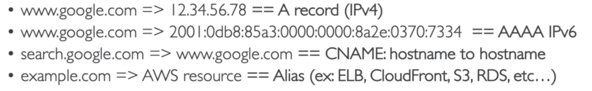
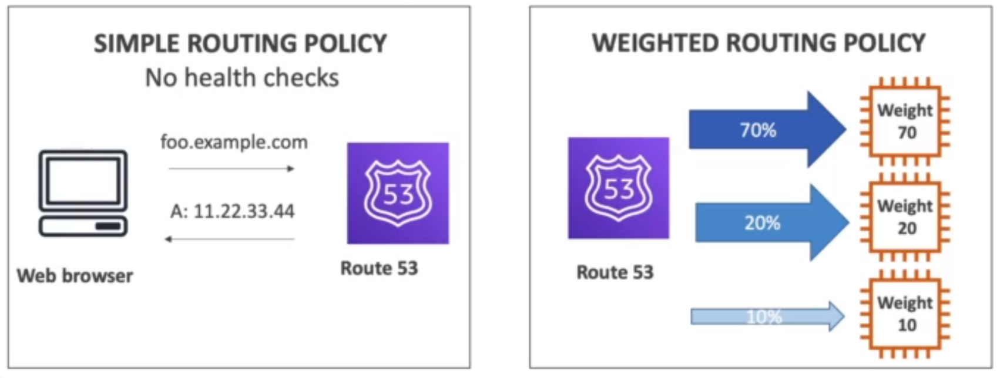
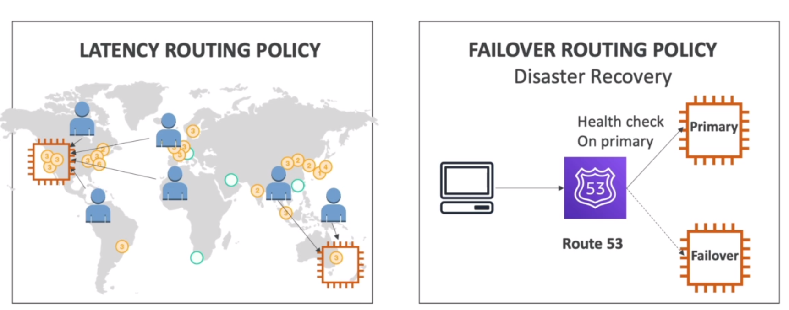

# **WHY MAKE A GLOBAL APPLICATION?**

1.  A global application is an application deployed in multiple geographies.
2.  On AWS: this could be Regions and / or Edge Locations.
3.  Decreased Latency.

            - Latency is the time it takes for a network packet to reach a server.
            - It takes time for a packet from Asia to reach the US.
            - Deploy your applications closer to your users to decrease latency, better experience.

4.  Disaster Recovery (DR):

            - If an AWS region goes down (earthquake, storms, power, shutdown, politics).
            - You can fail-over to another region and have your applcation still working.
            - A DR plan is important to increase the availability of your application.

5.  Attack Protection: Distributed global infrastructure is harder to attack.

## **GLOBAL AWS INFRASTRUCTURE**

1. Regions : For deploying applications and infrastructure.
2. Availability Zones: Made of multiple data centers.
3. Edge Locations(points of presence): for content delivery as close as possible to users.

# **GLOBAL APPLICATIONS IN AWS**

1.  Global DNS: Route 53

        - Great to route users to the closest deployment with least latency.
        - Great for disaster recovery strategies.

2.  Global Content Delivery Network (CDN): CloudFront.

        - Replicate part of your application to AWS Edge Locations - decrease latency.
        - Cache commn requests - improved user experience and decreased latency.

3.  S3 Transfer Acceleration :

        - Accelerate global uploads & downloads into Amazon S3.

4.  AWS Global Accelerator:

        - Improve global application availability and performance using the AWS global network.

# **ROUTE 53 OVERVIEW**

1. Route53 is a Managed DNS(DOMAIN NAME SYSTEM).
2. DNS is a collection of rules and records which helps clients understand how to reach a server through URLs.

3. In AWS, the most common records are :

# **Route 53 Routing Policies**

IMPORTANT:

1. **Simple Routing Policy**, which has **no Health checks**.
   So our Web browser will go into our DNS system, does a DNS query and gets an IPv4 for example as a result, that's a simple routing policy.

2. **Weighted Routing Policy**, Allows to distribute the traffic across multiple institute instances. In the image we need to assign weights to our institute instances, for example 70,20,and 10.
   And then our DNS we'll make sure that our clients have 70% of the traffic onto the first one. 20% of the traffic onto the second one and 10% of the traffic on to the third one.

This is effectively some kind of load balancing, So in this Weighted Routing Policy,
**We can use health checks**.

3. **Latency Routing Policy**, In the image we are displaying our application globally, one in California and the other one in Australia. And our users are all around the world, The Latency Routing Policy we'll look at where the user is located and if they're located close to our Kelly American Institute Instance, then they will be redirected to talk to that server.

And if they're close to Australia, then they will be redirected to talk to the Australia server.

And this is based on the latency, So in this example, Route 53 will be used to minimize the latency betweeen the users and the servers by making the users connect to the server.

That is the closest to them.

4. **FAILOVER ROUTING POLICY**, Disaster Recovery, we have a client and we have a primary institute instance and Failover one, and so our DNS system will do a Health check ON the primary.

And in case the primary instance fails, then we will be redirected to the failovers.
this help with disaster recovery.

So the clients will know exactly thanks to Route 53, which instance to connect to based on the health of that instance.

