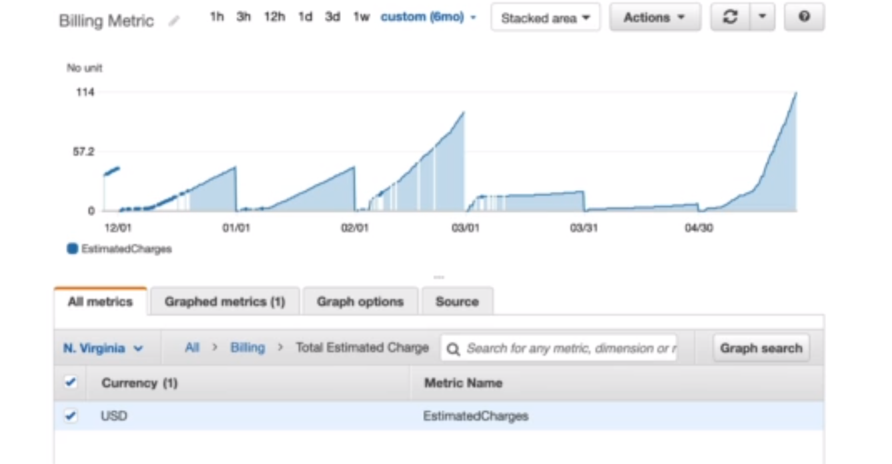
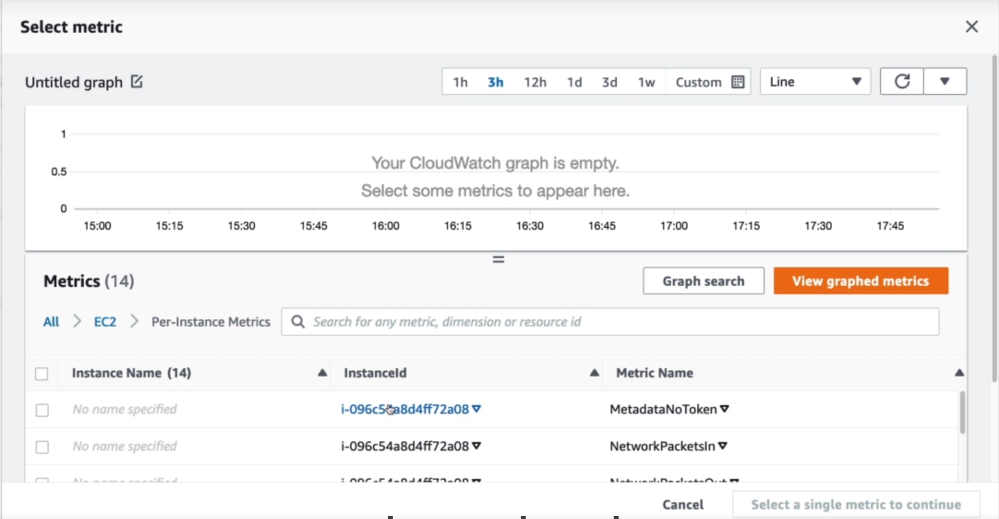

# **AMAZON CLOUDWATCH METRICS**

1. CloudWatch provides metrics for every services in AWS.
2. Metric is a variable to monitor (CPUUtilization, Networking).
3. Metrics have **timestamps**.
4. Can create **CloudWatch** dashboards of metrics.

## **IMPORTANT METRICS**

1. **EC2 Instances:** CPU Utilization, Status Checks, Network(not RAM).

   1. Default metrics every 5 minutes.
   2. Option for Detailed Monitoring ($$$) : metrics every 1 minute.

2. **EBS Volumes:** Disk Read/Writes
3. **S3 Buckets:** BucketSizeBytes, NumberOfObjects, AllRequests.
4. **Billing:** Total Estimated Charge (only in us-east-1).
5. **Service Limits:** How much you've been using a service API.
6. **Custom metrics:** Push your own metrics.

## **AMAZON CLOUDWATCH ALARMS**

1. Alarms are used to trigger notifications for any metric.
2. Alarms actions...

   1. Auto Scaling: Increase or decrease EC2 instances "desired" count.
   2. EC2 Actions: stop, terminate, reboot or recover an EC2 Instance.
   3. SNS notifications: send a notification into an SNS topic.

3. Various options (sampling, %, max, min, etc...).
4. Can choose the period on which to evaluate an alarm.
5. Example : create a billing alarm on the CloudWatch Billing Metric.
6. Alarm States : OK.INSUFFICIENT_DATA,ALARM.

**HANDS ON**

1. CloudWatch
2. All Metrics

## **AMAZON CLOUDWATCH LOGS**

1. CloudWatch Logs can collect log from:

   1. Elastic Beanstalk : collection of logs from application.
   2. ECS: Collection from containers.
   3. AWS Lambda: Collection from function logs.
   4. CloudTrail based on filter.
   5. CloudWatch log agents: on EC2 machines or on-premises servers.
   6. Route53: Log DNS queries.

2. Enables real-time monitoring of logs.
3. Adjustable CloudWatch Logs retention.

## **CLOUDWATCH LOGS FOR EC2**

1. By default, no logs from your EC2 instance will go to CloudWatch.
2. You need to run a CloudWatch agent on EC2 to push the log files you want.
3. Make sure IAM permissions are correct.
4. The CloudWatch log agent can be setup on-premises too.

# **CLOUDWATCH EVENTS**

1. Schedule: Cron Jobs(scheduled scripts).
2. Event Pattern: Event Rules to react to a service doing something.
3. Trigger Lambda Functions, send SQS/SNS Messages...

# **AMAZON EVENTBRIDGE**

1. EventBridge is the next evolution of CloudWatch Events.
2. Default Events bus : generated by AWS services (Cloud Watch Events).
3. Partner Events bus : receive events from SaaS service or applications (Zendesk, DataDog, Segment, Auth0);
4. Custom Event Buses: for your own applications.
5. Schema Registry: Model event schema.
6. EventBridge has a different name to mark the new capabilities.
7. The CloudWatch Events name will be replaced with EventBridge.
