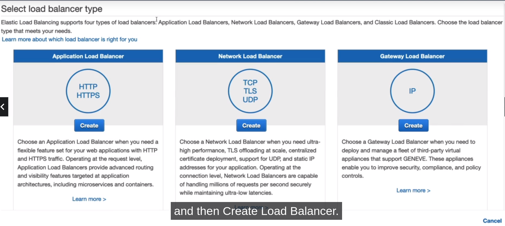
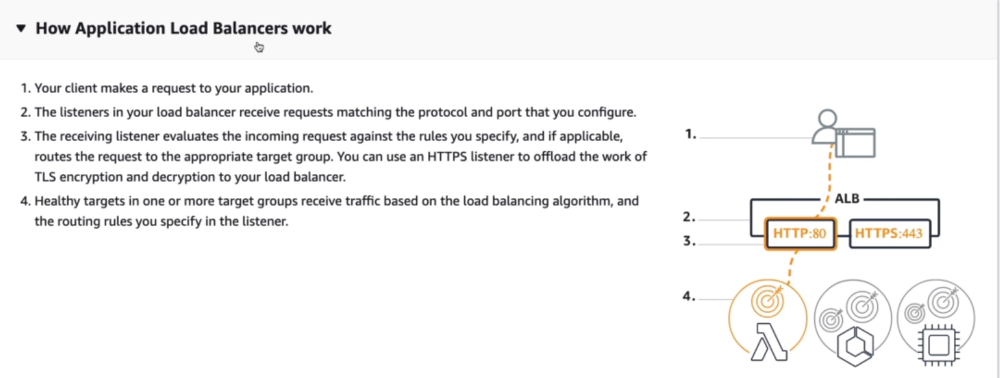
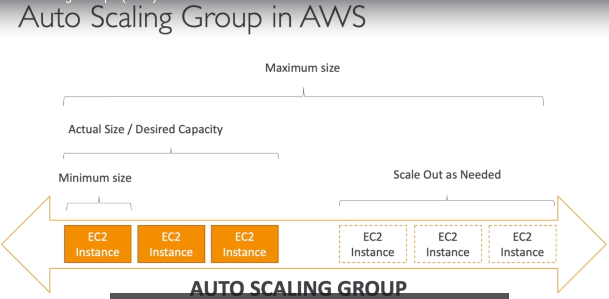
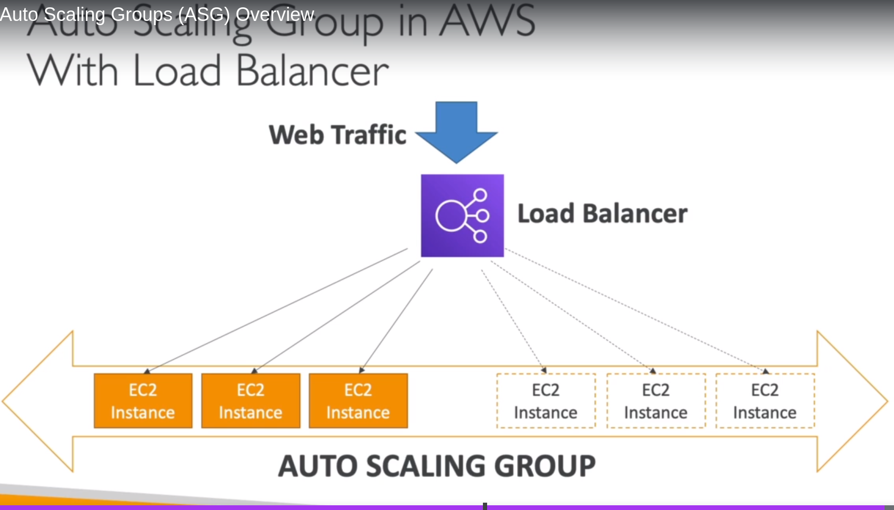

# **ELASTIC LOAD BALANCING & AUTO SCALING GROUPS SECTION**

**SCALABILITY & HIGH AVAILABILITY**

1. Scalability means that an application / system can handle greater loads by adapting.
2. There are two kids of scalability :

   - Vertical Scalability.
   - Horizontal Scalability (= Elasticity).

3. Scalability is linked but different to High Availability.

4. Let's deep dive into the distinction, using a call center as an example.

**VERTICAL SCALABILITY**

1. Vertical Scalability means increasing the size of the instance.

NOTE: Example : for our call center, say we have a junior operator and say we were able to upgrade that operator we would get a
senior operator.
and for example this senior operator can handle a lot more calls than the junior operator, because it's more experienced.
So this would be what vertical scalability looks like in a call center.

2. For example, your application runs on a t2.micro.
3. Scaling that application vertically means running it on a t2.large.
4. Vertical scalability is very common for non distributed systems, sucs as a database.
5. There's usually a limit to how much you can vertically scale (hardware limit).

**HORIZONTAL SCALABILITY**

1. Horizontal Scalability means increasing the number of instances / systems for your application.
2. Horizontal scaling implies distributed systems.
3. THis is very common for web applications / modern applications.
4. It's easy to horizontally scale thanks the cloud offerings such as Amazon EC2.

NOTE: Example: we have an operator and we want to do horizontal scalability for that operator that means we will add another operator and if we need to handle more calls. we will add another operator and so on.
So maybe we can scale horizontally from one operator ALL THE way six operators.
So when you have horizontal scaling that implies as you can see on the right hand side, that you need to have a distributed system.
And for a call center, that makes sense.

(NOTE:So if you have a web application or a modern application, You usually design it with horizontal scalability in mind.)

**HIGH AVAILABILITY**

1. High Availability usually goes hand in hand with horizontal scaling.
2. High availabiliy means running your application / system in at least 2 Availability Zones.
3. The goal of high availability is to survive a data center loss.(disaster).

**HIGH AVAILABILITY & SCALABILITY FOR EC2**

1. Vertical Scaling: Increase instance size (= scale up / down).
   a. From: t2.nano - 0.5G of RAM, I vCPU.
   b. To: u-I2TBI.metal - I2.3TB of RAM, 448 vCPUs.

2. Horizontal Scaling: Increase number of instances (=scale out/ in)
   a. Auto Scaling Group.
   b. Load Balancer.

3. High Availability: Run Instances for the same application across multu AZ
   a. Auto Scaling Group multi AZ.
   b. Load Balancer multi AZ.

IMPORTANT:

# **WHAT IS LOAD BALANCING**

This is the service that will allow us to be more elastic on AWS.

1. Load balancers are servers that forward internet traffic to multiple servers (EC2 Instances) downstream.

(They are also called the backhand EC2 instances), so Elastic Load Balancing is something that is managed by AWS, so we have a load balancer and this is what we will be publicly exposing for our users.
And behind that load balancer, we will have multiple EC2 Instances, maybe three in that case.
And then we have our first user. Talking to our load balancer. and the load balancer will be direncting the traffic to one of these EC2 instances. And the EC2 instance will reply back with something.

And the user will get the response.
But now if the second user comes in, then we will get the reply from another EC2 instance, and if a third user comes in, as you can expect, it will be replying from another EC2 Instance.
And so the load balancer, the more users we have, the more it will balance the load across multiple EC2 instances. And that will allow us to scale better our backend.

**WHY USE A LOAD BALANCER**

1. Spread load across multiple downstream instances.
2. Expose a single point of access (DNS) to your application.
3. Seamlessly handle failures of downstream instances.
4. Do regular health checks to your instances.
5. Provide SSL termination (HTTPS) for your websites.
6. High availability across zones.

**WHY USE AN ELASTIC LOAD BALANCER?**

1. An ELB (Elastic Load Balancer) is a managed load balancer.
   a. AWS guarantees that it will be working.
   b. AWS takes care of upgrades, maintenance, high availability.
   c. AWS provides only a few configuration knobs.

2. It costs less to setup your own load balancer but it will be a lot more effort on your end (maintenance, integrations).
3. 3 kinds of load balancers offered by AWS:
   a. Application Load Balancer (HTTP / HTTPS only) = Layer 7.
   b. Network Load Balancer (Ultra high performance allows for TCP) = Layer 4.
   c. Classic Load Balancer (slowly retiring) = Layer 4 & 7.

**APPLICATION LOAD BALANCER (ALB) HANDS ON**

Create Load Balancer =

CREATE APPLICATION LOAD BALANCER :

**WHAT'S AN AUTO SCALING GROUP?**

1. In real-life, the load on your websites and application can change.
2. In the cloud, you can create and get rid of servers very quickly.
3. The goal of an Auto Scaling Group (ASG) is to:
   a. Scale out (add EC2 instances) to match an increased load.
   b. Scale in (remove EC2 instances) to match a decreased load.
   c. Ensure we have a minumun and maximun number of machines running.
   d. Automatically registes new instances to a load balancer.
   e. Replace unhealthy instances.

4. Cost savings only run at an optimal capacity (principle of the cloud).

**AUTO SCALING GROUP IN AWS**

**AUTO SCALING GROUP IN AWS WITH LOAD BALANCER**
web traffic can be coming in through our load balancer, which will be redirectiong the traffic directly into your EC2 instance.

