# **AMAZON S3**

IMPORTANT:

1. Amazon S3 is one of the main building blocks of AWS.
2. It's advertised as "infinitely scaling" storage.
3. Many websites use Amazon S3 as a backbone.
4. Many AWS services uses Amazon S3 as an integration as well.
5. We'll have a step-by-step approach to S3.
6. The CCP exam requires "deeper" knowledge about S3.

**S3 USE CASES**

1. Backup and storage.
2. Disaster Recovery.
3. Archive.
4. Hybrid Cloud Storage.
5. Application Hosting.
6. Media Hosting.
7. Data lakes & big data analytics.
8. Software delivery.
9. Static Website.

**AMAZON S3 OVERVIEW - BUCKETS**

1. Amazon S2 allows people to store objects (files) in "buckets" (directories).
2. Buckets must have a globally unique name (across all regions all accounts).
3. Buckets are defined at the region level.
4. S2 looks like a global service but buckets are created in a region.
5. Naming convention.

   a. No uppercase.
   b. No underscore.
   c. 3-63 characters long.
   d. Not an IP.
   e. Must start with lowercase letter or number.

**AMAZON S3 OVERVIEW - OBJECTS**

1. Objects (files) have a **key**.
2. The **key** is the FULL path:
   a. s3://my-bucket/my_file.txt
   b. s3://my-bucket/my_folder/another_folder/my_file.txt

3. The **key** is composed of prefix + object name
   a. s2://my-bucket/my_folder/another_folder/my_file.txt
4. There's no concept of **"directories"** within buckets (although the UI will trick you to think otherwise).
5. Just **keys** with very long names that contain slashes ("/).

6. Object values are the content of the body:
   a. Max object size is 5TB (5000GB)
   b. If uploading more than 5GB, must use "multi-part upload"

7. Metadata (list of text key / value pairs - system or user metadata).
8. Tags (Unicode key / value pair - up to 10) - useful for security / lifecycle.
9. Version ID (if versioning is enabled).

**S3 HANDS ON**

1. Create a bucket (needs to be a unique name).
2. CHoose a region near to you.

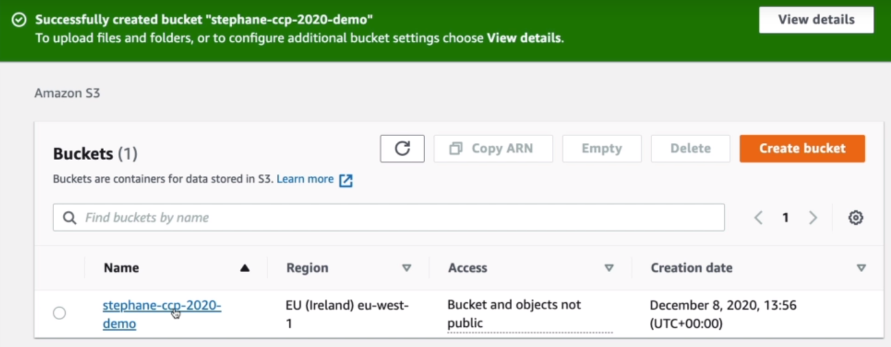

3. UPLOAD OBJECTS

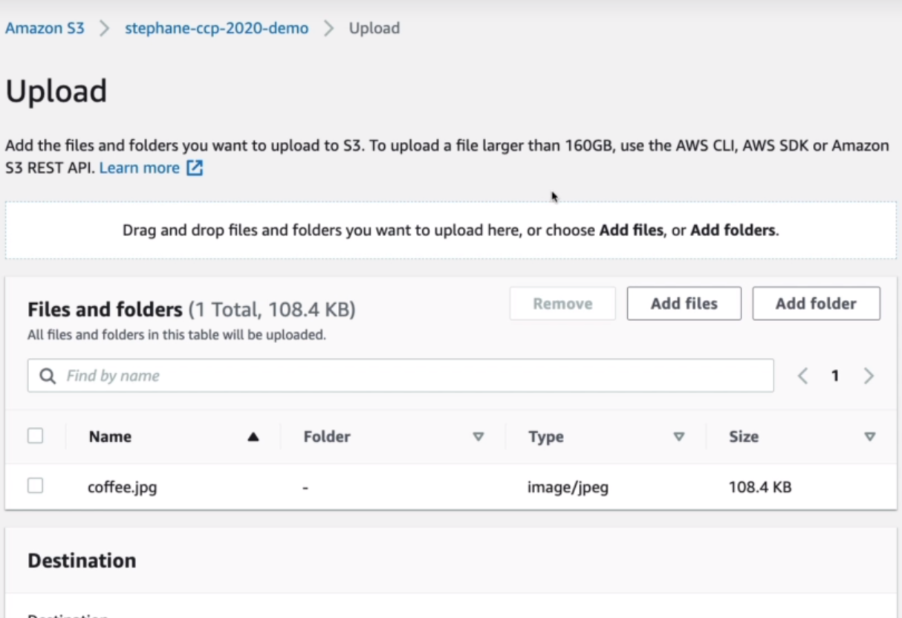

4. Click Upload , now the files has been upload.

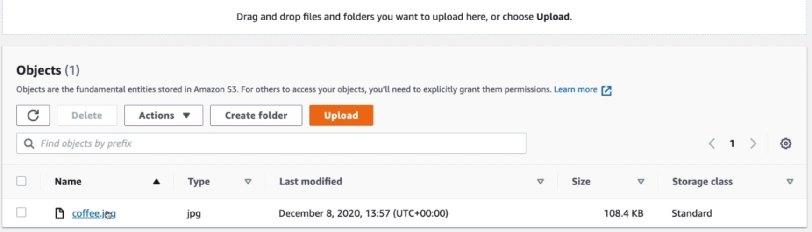

5. Click in coffee.jpg ===> YOU CAN SEE THE OBJECT OVERVIEW.

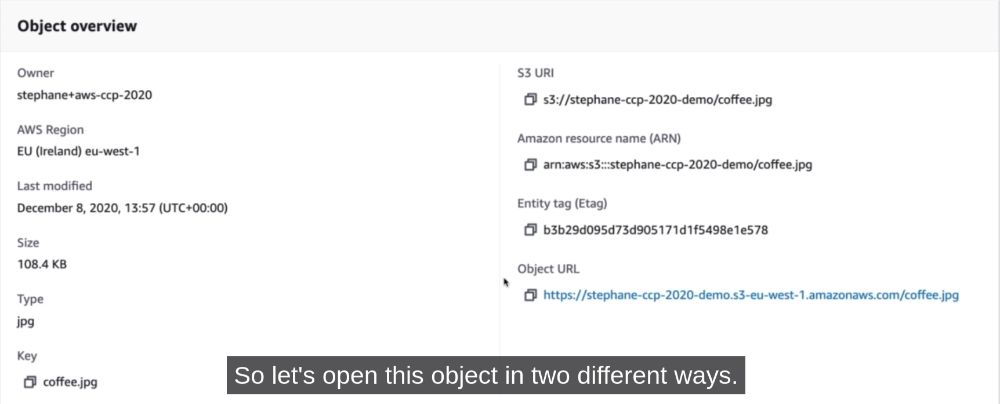

**ACTIONS**

NOTE: open object actions = and click in open (You can see the image). ====> **is open into a pre-signed URL** and it contains
the AWS credentials into the URL.
But if we click on bucket url the access is denied because we don't have the right to access the objects. So how come this worked in the second tab but not in the third tab. That's because the bucket is not public.

**CREATE A FOLDER**

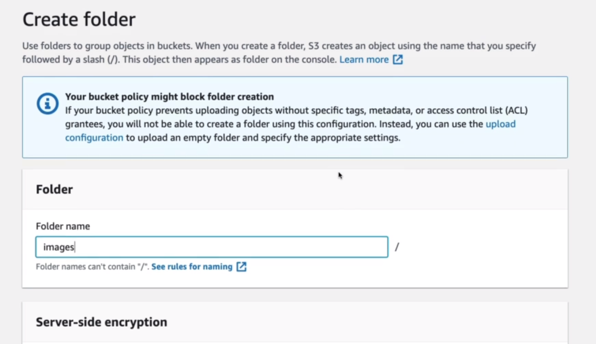

//NOTE: Now we have the coffee.jpg and the images/ folder.

Inside the folder you can upload files

**S3 SECURITY**

1. User based
   a. IAM Policies - which API calls should be allowed for a specific user from IAM console.
2. Resource Based.
   a. Bucket Policies - bucket wide rules from the S3 console - allows cross account.
   b. Object Access Control List (ACL) - finer grain.
   c. Bucket Access Control List (ACL) - less common.
3. NOTE: an IAM principal can access an S3 object if.
   a. the user IAM Permissions allow it OR the resource policy ALLOWS it.
   b AND there's no explicit DENY.
4. Encryption: encrypt objects in Amazon S3 using encryption keys.

**EXAMPLE: PUBLIC ACCESS - USE BUCKET POLICY**

//IMPORTANT: Probably exam question.

**CASE**

```
        ANONYMOUS WEBSITE VISITOR   ===========>   S3 BUCKET + S3 BUCKET POLICY | ALLOWS PUBLIC ACCESS.
```

We have an S3 bucket and say, we have someone not using your account.
This is anonymous worldwide web website visitor and they want to read the files from your S3 bucketS.
So by default, we saw if we try to read a file using the web browser there was an access denied.

To solve it, we have to attach an S3 bucket policy to our S3 buckets, which is going to allow public access, When this happen our web visitor thanks to the bucket policy, we'll be able to access to files onto our S3 Buckets.

**EXAMPLE: USER ACCESS TO S3 - IAM PERMISSIONS**

//IMPORTANT:

**CASE**

```
        IAM USER + IAM POLICY   ===========>   S3 BUCKET.
```

We can just thanks to the IAM policy allow the IAM user to access our S3 buckets.

**EXAMPLE: EC2 INSTANCE ACCESS - USE IAM ROLES**

**CASE**

```

EC2 INSTANCE ROLE | IAM Permissions

EC2 INSTANCE                        ==============> S3 Bucket.

```

**EXAMPLE: ADVANCED: CROSS-ACCOUNT ACCESS- USE BUCKET POLICY**

**CASE**

```
IAM User Other AWS account       ===================>  S3 Bucket + S3 Bucket policy, Allows Cross-Account.

```

# **S3 BUCKET POLICIES**

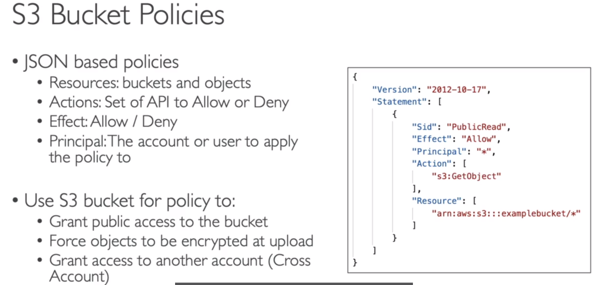

//NOTE: But we cannot use them for public access if we don't disable the security settings .

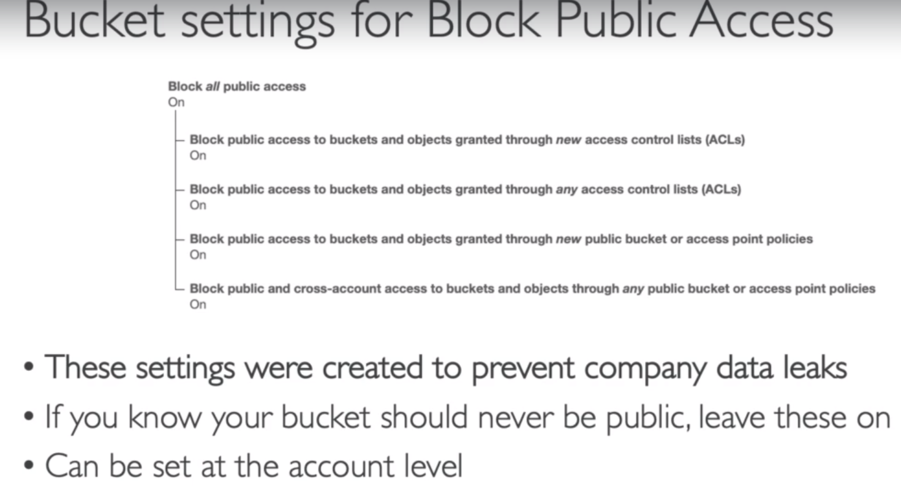

**S3 BUCKET POLICY HANDS**

1.  Go to = permissions.
2.  Create a public bucket policy.
3.  Edit public access (BUCKET SETTINGS).
4.  Edit bucket policy = Policy examples | Policy Generator.
5.  Policy Generator :

    a. AMAZON RESOURCE NAME (ARN) ====> copy and paste the ARN and add (/\*) at the end.

         NOTE: Actions (GetObject)

         This policy allows the S3 GetObject action on this buckets object.

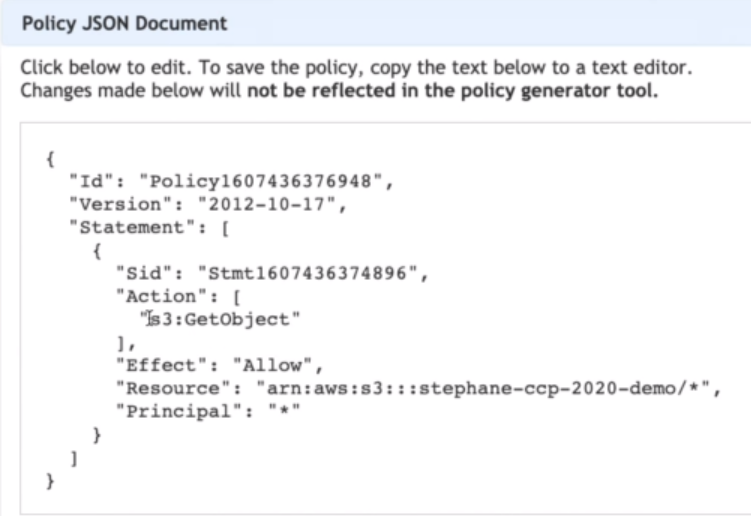

**S3 WEBSITES**

1. S3 can host static websites and have them accessible on the www
2. The website URL will be :
   a. <bucket-name>.s3-website=<AWS-region>.amazonaws.com
   OR
   b. <bucket-name>.s3-website.<AWS-region>.amazonaws.com

3. If you get a 403 (Forbidden) error, make sure the bucket policy allows piblic reads!!

**S3 VERSIONING**

1. You can version your files in Amazon s3.
2. It is enabled at the bucket level.
3. Same key overwrite wil increment the "version" : 1,2,3.
4. It is best practice to version your buckets
   a. Protect against unintended deletes (ability to restore a version).
   b. Easy roll back to previous version.
5. NOTES:
   a. Any file that is not versioned prior to enabling versioning will have version "null".
   b. Suspending versioning does not delete the previous versions.

**S3 ACCESS LOG**

1. For audit purpose, you may want to log all access to S3 buckets.
2. Any request made to S3, from any account, authorized or denied, will be logged into another S3 bucket.
3. That data can be analyzed using data analysis tools...
4. Very helpful to come down to the root cause of an issue, or audit usage, view suspicious patterns, etc...

//NOTE: TARGET BUCKET

    s3://stephane-server-access-logging-2020-ccp/logs

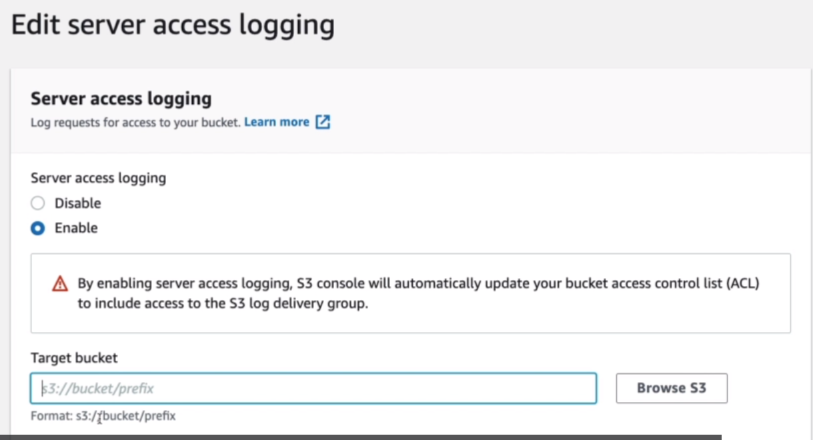

**S3 REPLICATION (CRR & SRR)**
**CROSS REGION REPLICATION AND SAME REGION REPLICATION**

1. Must enable versioning in source and destination.
2. Cross Region Replication (CRR).
3. Same Region Replication (SRR).
4. Buckets can be in differente accounts.
5. Copying in asynchronous.
6. Must give proper IAM permissions to S3.
7. **CRR - USE CASES:** Compliance, lowe latency access, replication across accounts.
8. **SRR - USE CASES:** Log aggregation, live replication betweeen production and test accounts.

**S3 STORAGE CLASSES**
//IMPORTANT:

1. Amazon S3 Standard - **Standard General Purpose.**
2. Amazon S3 Standard - **Standard Infrequent Access (IA).**
3. Amazon S3 Standard - **One Zone-Infrequent.**
4. Amazon S3 Standard - **Glacier Instant Retrieval.**
5. Amazon S3 Standard - **Glacier Flexible Retrieval.**
6. Amazon S3 Standard - **Glacier Deep Archive.**
7. Amazon S3 Standard - **Intelligent Tiering.**

**S3 DURABILITY AND AVAILABILITY**

Durability :

Represents how many times an object is going to be lost by Amazon S3.

1. High durability (99.99999999%, 11 9's) of objects across multiple AZ.
2. If you store 10.000.000 objects with Amazon S3, you can on average expect to incur a loss of a single object once every 10.000 years.
3. Same for all storage classes.

Availability :

Represents how readily a service is and this depends on the storage class.

1. Measures how readily available a service is :
2. Varies depending on storage class.
3. Example: S3 Standard has 99.9999% availability = not available 53 minutes a year.

**S3 STANDARD GENERAL PURPOSE**

1. 99.999%
2. Used for frequently accessed data.
3. Low latency and high throughput.
4. Sustain 2 concurrent facility failures.
5. Use cases : Big Data analytics, mobile & gaming applications, content distribution....

**S3 STORAGE CLASSES - INFREQUENT ACCESS**

1. For data that is less frequently accessed, but requires rapid access when needed.
2. Lower cost than S3 Standard.
3. Amazon S3 Standard Infrequent Access (S3 Standard IA).
   a. 99.9% Availability.
   b. Use cases : Disaster Recovery, backups.
4. Amazon S3 One Zone Infrequent Access (S3 One Zone IA)
   a. High durability (99.9999999999%) in a single AZ; data lost when AZ is detroyed.
   b. 99.5% Availability.
   c. Use Cases : Storing secondary backup copies of on-premise data, or data you can recreate.

**S3 GLACIER STORAGE CLASSES**

1. Low cost object storage meant for archiving / backup.
2. Pricing: Price for storage + object retrieval cost.

3. Amazon S3 Glacier Instant Retrieval
   a. Millisecond retrieval, great for data accessed once a quarter.
   b. Minimun storage duration of 90 days.
4. Amazon S3 Glacier Flexible Retrieval (formerly Amazon S3 Glacier):
   a. Expedited (I to 5 minutes), standard (3 to 5 hours), Bulk (2 to 12 hours) - free.
   b. Minumun storage duration of 90 days.
5. Amazon S3 Glacier Deep Archive - for long term storage:
   a. Standard(12 hours), Bulk (48 hours).
   b. Minumun storage duration of 180 days.

**S3 INTELLIGENT TIERING**

1. Small monthly monitoring and auto tiering fee.
2. Moves objects automatically between Access Tiers based on usage.
3. There are no retrieval charges in S3 Intelligent Tiering.

4. Frequent Access Tier(automatic) : default tier.
5. Infrequent Access Tier(automatic) : Objects not accessed for 30 days.
6. Archive Instant Access Tier(automatic) : objects not accessed for 90days.
7. Archive Access tier(optional) : configurable from 90 days to 700+ days.
8. Deep archive access tier (optional) : config. from 180 days to 700+ days.

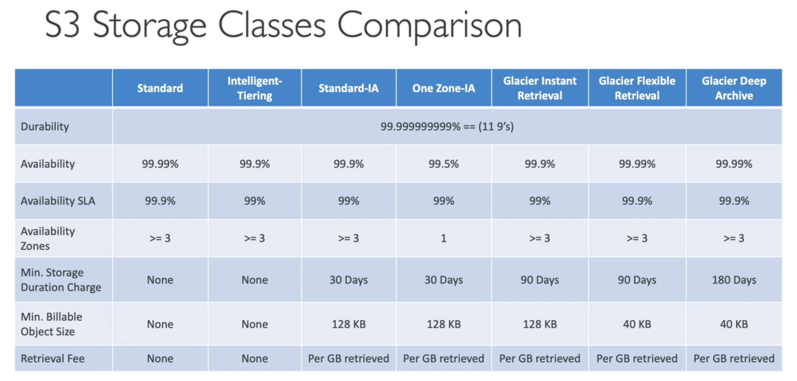

**S3 OBJECT LOCK & GLACIER VAULT LOCK**

1. S3 OBJECT LOCK
   a. Adopt a WORM (Write Once Read Many) model.
   b. Block an object version deletion for a specified amount of time.

2. GLACIER VAULT LOCK
   a. Adopt a WORM (Write Once Read Many) model.
   b. Lock the policy for future edits (can no longer be charged).
   c. Helpful for compliance an data retention.

3. S3 ENCRYPTION

In the first case we send the file into the S3 bucket, and is uploaded as is. This is a no encryption type of scheme, because the file hasn't been modified. It hasn't been encrypted.

Now we have a server side encryption, the user wants to upload a file into amazon s3, the server is going to encrypt the file server side. so the server encrypts the file after reveiving it.

That's why it's called server side encryption AND WE PROTECT THE FILE FOR UNAUTHORIZED USAGE.

And in the Client Side Encryption, The client is the user and therefore this user will encrypt the file before uploading it.
So the encryption is happening client side and then it gets uploadded into Amazon S3. so the file is already encrypted while being in Amazon S3 and it has been encrypte by the user NOT BY THE SERVER.

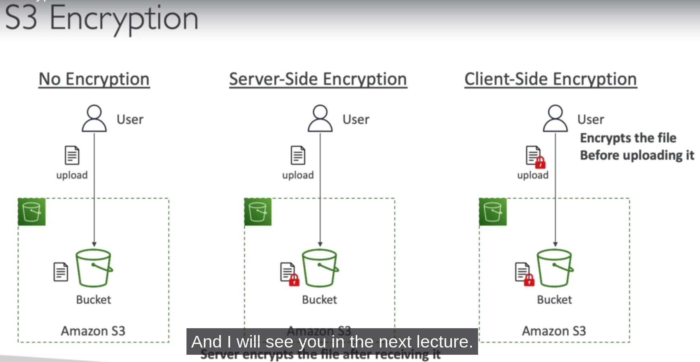

**SHARED RESPONSIBILITY MODEL FOR S3**

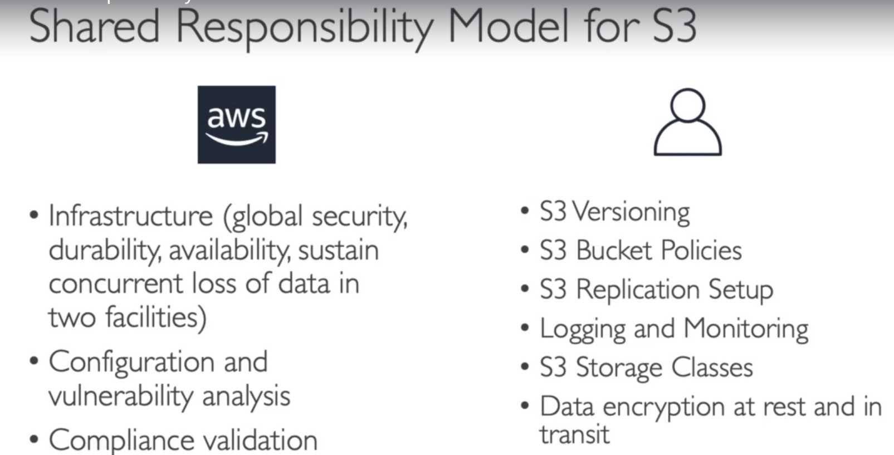

**AWS SNOW FAMILY**

1. Highly secure portable devices to collect and process data at the edge, and migrate data into and out of AWS.

a. Data migration: Snowcone | Snowball Edge | Snowmobile
b. Edge Computing: Snowcone | SNowball Edge

NOTE: IF WE LOOK AT THE TIME IT TAKES TO TRANSFER A LOT OF DATA OVER THE NETWORK. IT CAN TAKE A LOT OF TIME.
FOR EXAMPLE, IF WE WANT TO TRANSFER 100 TERABYTES OVER ONE GIGABITS PER SECOND NETWORK LINE, IT WILL TAKE US 12 DAYS TO ACHIEVE IT.

IF WE DO A PETABYTE, IT WILL TAKE FOREVER.

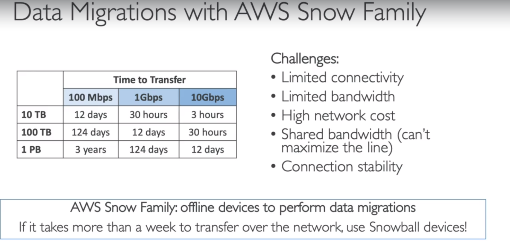

**DIAGRAMS**

1. Direct upload to S3:

NOTE: If we wanted to directly upload a file into Amazon S3, We have the clients send the data into Amazon S3.
But with the Snow Family or with the Snowball device, the clients request this novel device. We receive it via the post AWS will deliver the device to us. We loaded the data directly onto the devices locally, and then we ship back the device to AWS into an AWS facility then they will take the device and they will plug it into their own infrastructure and then the data will be imported or exported based on what you wanna do to an Amazon S3 bucket and you are good to go.

This is a way to transfer data to AWS, but through the physical, no the network route.

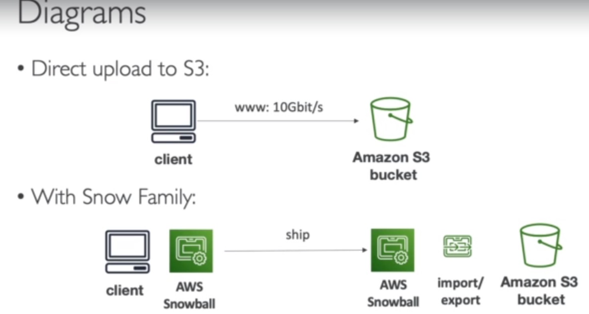

**SNOWBALL EDGE (FOR DATA TRANSFERS)**

NOTE: So now what sort of devices do we have ??

1.  Physical data transport solution : move TBs or PBs of data **in our out** of AWS.
2.  Alternative to moving data over the network (and paying network fees).
3.  Pay per data transfer job.
4.  Provide block storage and Amazon S3-compatible object storage.
5.  Snowball Edge Storage Optimized

            a. 80 TB of HDD capacity for block volume and S3 compatible object storage.

6.  Snowball Edge Compute Optimized

            a. 42 TB of HDD capacity for block volume and S3 compatible object storage.

7.  Use cases : large data cloud migrations, DC decommission, disaster recovery.

**AWS SNOWCONE**

1. Small, portable computing, anywhere, rugged & secure, withstands harsh environments.
2. Light (4.5 pounds, 2.1 kg).
3. Device used for edge computing, storage, and data transfer.
4. 8 TBs of usable storage.
5. Use Snowcone where Snowball does not fit (space-constrained eviroment).
6. Must provide your own battery / cables.
7. Can be sent to AWS offline, or connect it to internet and use AWS DataSync to send data.

**AWS MOBILE**

1. Transfer exabytes of data (I EB = 1.000 PB= 1.000.000TBs).
2. Each Snowmobile has 100 PB of capacity (use multiple in parallel).
3. High Security : temperature controlled, GPS, 24/7 video surveillance.
4. Better than snowball if you transfer more than 10 PB.
